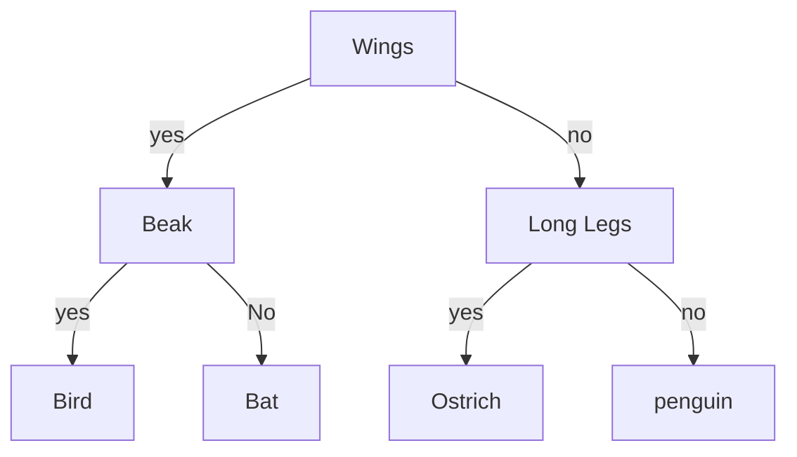
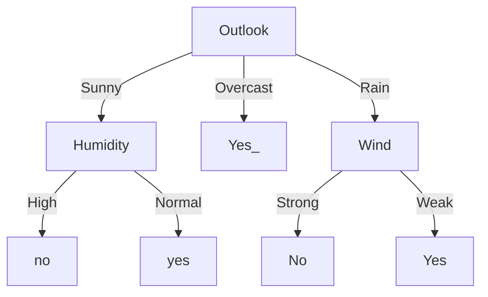

# Tree Models

A tree models is a type of model based on an hierarchy of condition, and in which the leaves contain the final outcomes.
These are among the most common types of models in usage.

## Decision Tree Classifiers

One such example of a tree model is a DTC(Decision Tree Classifiers), in these models we train the tree with a set data and after the tree is create it is capable of separating perfectly positives and negatives.

Take for example the past diagram its main purpose is too classify animals. 
Take for example the entry `` Wings /\ ~Beak `` we can with this infer we are talking about a Bat.

Our objective with these decision trees is, for a given N dimensional problem, create a tree that can accurately classify all entries and has a node for every variable we need to classify.
Take into account that the [[T02#Curse of Dimensionality]] is still something we should take into account in these situations.
For this purpose, we usually try to find the best possible variable that can most accurately separate all features according to their respective class, these points of separation are called splits.

## Finding the best Splits

One can only hope that the process of finding a split is as simple as if X then true and if ~X then false.
Unfortunately this is not usually the case and for these more complex problems we must find a way to define which variables are more relevant for the end result.

Take the following example:
In this case we can see that no one played if the temperature was hot
Moreover, we can see that if outlook as rain and if the wind was Weak they always played.

| Day | OutLook | Temp | humidity | Wind   | Play |
| --- | ------- | ---- | -------- | ------ | ---- |
| D1  | Sunny   | Hot  | High     | Weak   | No   |
| D2  | Sunny   | Hot  | High     | Strong | No   |
| D3  | OverCast   | Hot  | High     | Weak   | Yes  |
| D4  | Rain   | Mild | High     | Weak   | Yes  |
| D5  | Rain   | Cool | Normal   | Weak   | Yes  |

From this we can come to the conclusion that these variables have a bigger influence that the other over if Play is true of false.
In order to measure this value in or variables we can make use of entropy, this being a measure of the information required to describe a system.
And being described by:
$$Entropy = -\sum_{i}{p_i*log_2*pi} $$ And where $p_i$ is the probability of event *i* occurring.

The value of entropy is maximum when the confusion is maximum, which means that there is the same probability of all events occurring.
The value of probability is 0 when there is certainty of an event occurring(usually when there only exists one event).

The objective in our case is to find the criterion(something to be decided in our case will be a column of our matrix) with the minimal value of entropy.
To find the best criterion on a data set we must not only take into consideration the column we want analyse but also the column of the results we want to get. After this we must calculate the entropy for all these pairs. And then choose the one with the smallest entropy.

We can calculate for the above table and we will get that the best criterion is outlook. And therefore we can create the following tree.

To know the order by which the nodes should be evaluated we need only to calculate the entropy taking into consideration the above variables, meaning that to calculate the entropy of humidity, we must take into consideration Outlook in the math.

## Stopping criteria

The usage of stopping criteria has a great effect in the way the tree behaves.
Just the simple usage of different criteria over a data set can lead to completely different trees and moreover completely different models and results.
Some usual stopping criteria are:
- Max depth 
- Minimum samples per split 
- Minimum samples in the leaf 
- Maximum leaf nodes 
- Minimum impurity decrease

### Impurity 
Just like entropy impurity is used to build decision trees and define which feature should be split into nodes to form the tree.
This value is calculated using the probability of positive classes.
$P=n_+/(n_+ + n_-)$ where P will be the probability, $n_+$ or $n_-$ is the magnitude of the positive and negative classes.

This value should not depend if a positive class passes to to negative and should always be P $\subset [0..1]$  with maximum at 0.5.
There are 3 main methods of calculating impurity:
- Minority Class $min(P,1-P)$
- Gini index $2P(1-P)$
- Entropy --> GO SEE THE BLOODY SLIDES IN NOT WRITING THAT AA_2223_T03 slide number 15

## Regression Trees(Not too good)

Using the Gini criterion, we can instead of classify a certain entry we can make use of CART( algorithm similar to I3) to make continuous interpretation of the data and therefore find the real value that maximizes class separation.
We can therefore create a regression tree in a way.

# DT a summary

DT are one of the most simple models, they are simple and easily explainable, are stable and don't depend on the order of the data, are fast to learn, fast to make predictions.
Unfortunately they are not updatable with new data and need to be trained again if there are changes to the dataset.

## Advantages
- Simple
- Popular
- Can be used for Classification and Regression
## Disadvantages
- Possible Exponential number of splits
- Handling missing variables
- Non binary splits can be a pain

# Feature Trees
Go read the slides