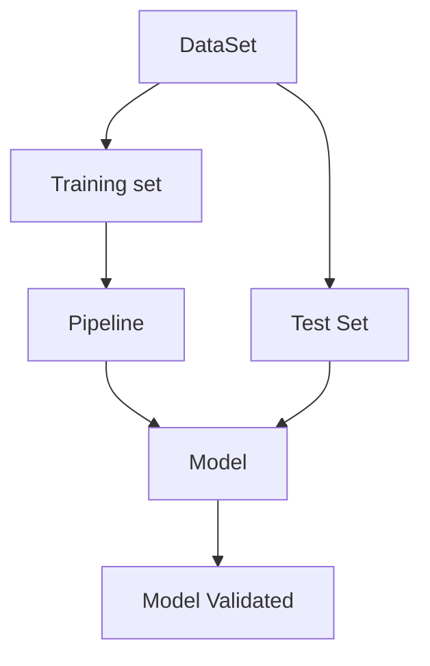

# Evaluating Models

It is our main focus to get good models that give good results. 
Unfortunately, it is very difficult to define a good result, and with enough time everyone can make a models that looks good on paper and has good values but as no significance regarding the problem, usually these models have a strong bias.

> "If you torture your data long enough it will confess to anything“ 
> \- Ronald H Coase

To solve this problem we must find a way to analyse our models and separate the good ones, that can give valid results, from the one that just work really well over our established data.

## Regression Models - Evaluation

To classify regression models we usually depend on 2 factors:
- The variance of the dependent variable
- The average prediction error

To analyse these two parameters there are a lot of metrics we can use
- Ratio of variance explained
- Root mean squared error
- Pearson Correlation Coefficient
- Maximum Error
- ...

All of these in someway analyse the 2 variables above and give a certain value that can be analysed to measure how good the models is.
Take into consideration, that all of them represent different things are some are better suited for some types of problems than others.

## Classification Models - Evaluation

The process of evolution of Classification models is dependent on how good the models is at classifying (genius i know).
Therefore we must only analyse the correctly and incorrectly classified instances.

We can therefore separate our data set into 4 categories:
- TP - True Positives -> Correctly classified values with positive values
- TN - True Negatives -> Correctly classified values with negative values
- FP - False Positives - incorrectly classified positive values
- FN - False Negatives - incorrectly classified negative values
These will be the four variables we will use to calculate our metrics for the classification models.
And can be organized in the form of a Confusion Matrix
![[ConfusionMatrix.png|400x300]]
### Metrics

Accuracy $ACC = \frac{TP + TN}{P + N}$
Recall/ True Positive Ratio = $TPR = \frac{TP}{P}$
Precision = $PPV = \frac{TP}{TP+FP}$
F1 Score = $F1 = 2 * \frac{PPV * TPR}{PPV + TPR}$
Mathews Correlation = Go see the formula

All of these of course have some caveats, take for example accuracy which is only reliable if the data set is balanced, or MCC which needs alterations for multiclass problems.

# Model Validation

More than evaluating the models, the most important step is their validation, this process gives confirmation that the model works.
To validate a model, we must test if the model is good at doing what it is meant to do be it regression, classification, ... .
For this purpose we must take a new dataset, usually one we know the answers, and check if the model is good at evaluating this new data.
We must never use the same data for training and validation.

## Overfitting and Underfitting

The existence of bias in a model isn't good or bad, but too much or too little can lead to two specific problems.

### Overfitting
Overfitting occurs when the model has high training bias
In these cases the model relies too much on patterns for identifying in the noise
This problem is solved by increasing the size of the sample data.

### Underfitting
Underfitting occurs when the model is unable to capture patterns in the training data
It is characteristic of oversimplified models, or models with too few variables.

## Prospective vs Retrospective Validation

When validating a model, we usually use data that we know the result of.
Taking this into consideration, there are 2 approaches we can do to sampling this new data.

### Retrospective
We can separate the original dataset into a training set and a test set

### Prospective
We can use data obtained posteriorly to the model being fitted
 
### Generally speaking Prospective is better than retrospective, although this type of validation is:
- More difficult
- Not immediate
- Less Biased
- More Accurate

## Cross Validation
Cross validation is a resampling method that uses multiple samples of the data to obtain better models.
There are a multitude of cross validation models but some are:

### Simple cross validation
In which we split the data into a training set and a test set and work from there.
It has issues considering that the results are highly dependant of the random partition
How do we defined which one of these results is the "best" one

### K-Fold cross validation
We split the data set into k partitions, and train our k models with k-1 partitions. The final model will be the combination of the results of our k models.
Using this we make usage of the entire dataset.
It is more robust than simple but more resistant to bias.

### Leave-One-Out cross validation
It is similar to K-Fold, but we use a variant k that starts at 1 and goes up to the size of the entire dataset.
It is very expensive an not necessarily the best option.

# Pipeline

The process of model validation consists therefore of several steps

The pipeline will be multiple models we want to test, all of these will pass through multiple steps with the purpose of validating and testing them, finally our goal will be that after all of this we will have obtained the "best" model for our specific problem. 

# Summary

We should always try to be objective in our assessment and not have ourselves bias towards a specific model or solution
In general we should strive for the simplest model possible, not only because they are usually correct but also they are simpler to process.