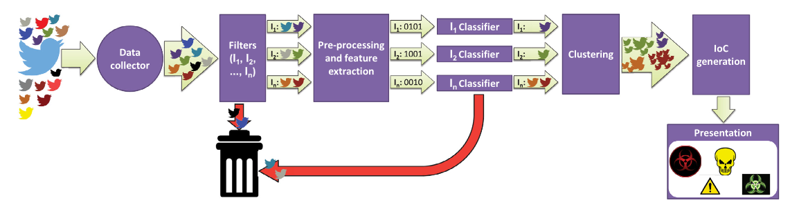

# Processing tweets for cybersecurity threat awareness

# Introduction

### Background
Security annalists need to be aware of developments in updates,patches,vulnerabilities and attacks to properly do security
To help with this task, it is common to use SOC and SIEM to allow to correlate the latest cyber security news with internal security events
To obtain cyber security news, there are 2 main approaches
- Curated feeds
- Open source Intelligence

The appeal of the second lead to OSINT being integrated in many SOC's.
One main source of information is twitter
There are many prominent security feeds which deliver though twitter

OSINT's usually have 2 requirements
- Good data selection 
- Good post-processing
While there was already some work in this field, the majority of systems using this approach were rudimentary and had some caveats like:
- Depended on secondary cybersecurity data source
- Restricted to collecting tweets from specific topics
- Restricted to specific types of attacks

### SYNAPSE
With this lack of specific needs in the market, the paper proposes SYNAPSE a twitter based cybersecurity threat monitor, which generates a constant summary of cybersecurity threats in a system.
There were 2 main questions to be solved in SYNAPSE
- Select cyber security related tweets
- Aggregate related tweets

#### Selecting cyber security tweets
All tweets were collected from previously selected accounts, which had a focus on cybersecurity
Then was used a supervised machine learning model to select the tweets according to relevance to the IT infrastructure

#### Aggregate related tweets
In order to aggregate tweets, the authors used clustering techniques over all of the collected tweets
This way each cluster would be related to a specific topic/subject

### Validation
In order to validate the finds, SYNAPSE was tested in a set of 200k tweets from 80 accounts with a TP rate of 80% and a FP rate under 10%
Moreover, it was possible to use SYNAPSE to compare registry to the NVD(National Vulnerability Database) vs twitter found data, which allowed the researchers to come to the conclusion that twitter found vulnerabilities 8 days before NVD.
Finally the authors were able to integrate SYNAPSE with SOC, resulting in enriching the SOC awareness

# Related Work

Previous work that lead to SYNAPSE

## Twitter for cybersecurity

Previous work had been done to try to make cybersecurity services based on tweet information
This type of service searched tweets for specific topics , and used semantic trees to group them
These works concluded that exploits would be poster on twitter in average 2 days before NVD
These systems were able, to not only groups tweets by context but related different tweets by keywords and social-based features
Moreover, these approaches were extended to not only analyse tweets but to search tweets with dark web sources, and confirm the attacks
Taking this into account all of these approaches can be categorised into 2 sections
- Dependable ton secondary cybersecurity feeds
- Restricted in terms of number of topics

And both of these present serious problems regarding the usability
- The first loses the advantage twitter has over the "normal" cybersecurity feeds
- The second loses, because companies cant be only protected against some types of attacks

this all leads to users losing trust on the system

In lieu of these finding, SYNAPSE is proposed to have
- Better granulation between tweets categories allowing for more specificity in twitter types, and minimising false positives and misinterpretations
- Usage of a new type of stream clustering algorithm which doesn't require a priori definition of target number of clusters

## Threat intelligence tools

Usually IDS,anti-viruses and other tools make usage of traditional/non-traditional data sources to create IoCs to input into model so that the IDS can detect an intrusion.
Many projects have been made to use alternative data sources, for example using analysing scientific literature regarding android malware to create a malware detector for the same system
The general goal is to pass human readable information to machine readable information. This was not one of the defined goal for SYNAPSE
In general these tools don't employ advanced processing tools to filter and match threats, this lead to them not being particularly efficient  to solve our problem

## Stream Clustering

In general, clustering algorithms require a target number of clusters.
And algorithms previously presented that don't require this number usually miss important information, when used in the security field.
Alternative approaches, give a ranger to the number of clusters, with an upper bound, while this approach is more resilient, this algorithm also ignores some important threats

# SYNAPSE pipeline

The synapse pipeline goes as follows:

## Data Collection
The data collector requires a set of previously defined accounts which will be used to get cybersecurity tweets
The main importance of the accounts is the likelihood of them tweeting about cyber security news regarding the IT infrastructure of the system, and since these accounts usually follow OSINT sources, there is kind of like a chain between OSINT and synapse
This is better than collecting information based on keywords because it leads to less useless data.

## Filtering
Considering that in most cases the accounts tweets might not have information relevant to the systems in question, we still have a need to filter our collected data
Therefore for this filtering, we analyse using a keywords basis, searching for tweets that contain the keywords (this might be contradicting with what i said before, nbut in this case we already know the tweets are in some way relevant)
The keywords must be properly chosen.

## Pre-processing and feature extraction
In pre-processing the authors normalise the tweet representation.
Removing non $[a-z]$ characters, converting text number (like two)to their numerical counter part, among other changes
For example
- $\#Oracle \#Linux 6/7: Unbreakable Enter-prise kernel (ELSA-2016-3573) https://t.co/vLTel8NodG$
- oracle Linux six seven unbreakable enterprise kernel elsa hyphen two thousand and sixteen hyphen three thousand five hundred and seventy three

And storing this new representation instead of the tweet
It also computes Term Frequency–Inverse Document Frequency, to obtain a vector of weight values for each word.

## Classification
To support classification of tweets 2 classifiers where explored
- Support Vector Machines
- MLP Neural Networks
Both these classifiers where already used for similar problems with good results and good success rate

## Clustering
SYNAPSE uses clustering to aggregate similar tweets
The Clustream algorithms was chosen for being one with the best requirements to fulfil

## MISP compatible IoC generation
After clustring the tweets, the tweets are converted into IoC form to allows usage in SIEMs
These formats should also be extensible and adaptable, because of the unpredictable nature of tweets.
The IoC objects are then classified according to regular expressions used across the original tweets content.

# Tweet stream clustering (TODO) 

# Results

For testing was done using 2 sets of twitter accounts, S1 and S2
with 3 different datasets, each with different time intervals, different sets of accounts and different positive/negative ratio.
- D1 - Account set S1, 5 months of tweets
- D2 - Account set S1 and S2, 1 months of tweets
- D3 - Account set S2, 2 months of tweets
with different models, specifically MLP and SVM.
and lastly using the same keywords

When trying for results only D2 and D3 were used, but the model was trained in D1
This intended to check the behaviour of the model when trying to predict different accounts from the original, with data obtained posterior to the original dataset.
(Because D2 and D3 are posterior to D1)

## Classification
As expected results were worse for D2 and D3 since the new data had unmodelled patterns
And while the data might have been different the classifiers maintained a very high TPR and TNR
Additionally SVM achieved a better results than MLPNN, which lead to SVM being the model chosen to conduct the rest of the results

## Clustering
Multiple approaches were used when clustering, and by combining  D2 and D3 at the end of each day the results provided found good cohesion between member of the same cluster.
This is supported by the WTS and Jacquard distance seen during the clustering process over the different days, this provide evidence that each cluster had similar tweets about a single threat.
Therefore the set of clusters was able to provide a complete picture of the threat landscape
The usage of WTS cohesion each cluster could have tweets discussing multiple threats
Lastly when using re-clustering techniques the number of cluster grew. as expected. The authors still say this improves balance between information relevance represented and time required for analysis

## End-to-end benefit
When comparing tweet flow, with filtered tweets it is clear the purpose of the clustring algorithms, allowing for filtration of much of the clutter
The authors compared SYNAPSE, with Logstatsh filter a naive keyword-based approach.
This decreased substantially th e number of tweets considered crucial.

## Active threat monitor
The authors then tried to see how long a cluster stays active for (this is done by taking in the day the cluster is created and the day the cluster is last added to)
This showed that for a dataset of 100 days the majority of clusters had a lifetime of below 10 days with very few passing 15.

## Analysis of generated IoCs
Finally the authors analysed how effective the usage of SYNAPSE to create IoC's and the usage of twitter and SYNAPSE in special in comparison to more traditional ways of detecting vulnerabilities and finding patches (Common Vulnerabilities and Exposures and National Vulnerability Database).
In comparison, SYNAPSE was able to find a total of 122 vulnerabilities, with more than half with high impact and a tenth with critical level.
Regarding timing, it was common for synapse to find that twitter had discovered the vulnerabilities a couple days before the NVD.
Lastly, in some situation SYNAPSE was also able to find tweets with corrections to said vulnerabilities, this sooner than other services focused on providing patches,

This serves as proof of the value of using Twitter as security data source. 
SYNAPSE would allow a SOC analyst to get relevant data bout vulnerabilities and patches before they can become critical reducing exposure time.

# Conclusion
SYNAPSE is therefore a Twitter based steaming threat monitor for threat detection in security operation centers.
It implements a pipeline for gathering, filtering, classifying and clustring tweets.
These tweets can be analysed or fed to SIEM's or other security tools.
The system maximises TP and minimises irrelevant information.
It can be integrated with SIEM's and use the event of the system.