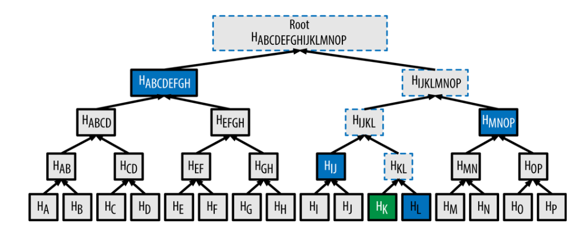
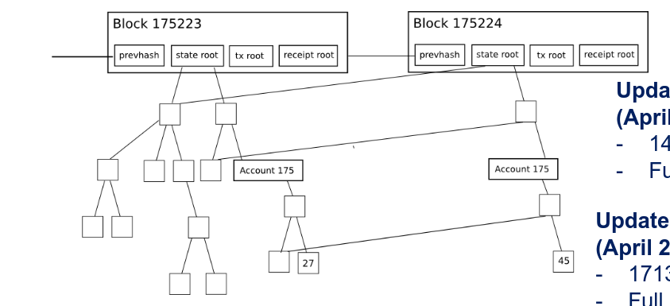
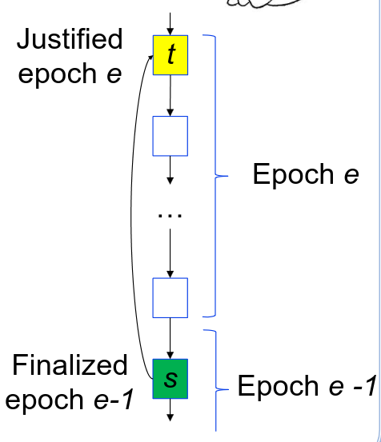
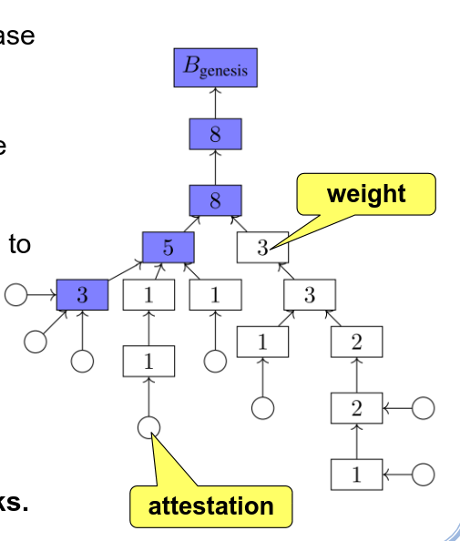

# Ethereum

Ethereum is a decentralized, open-source blockchain.

It allows the creation of smart contracts, which are self-enforcing and who control asset transaction.

Contracts are state machines replicated in the network.

It was a block time of 13 seconds, in comparison to bitcoin's 10 minutes. 

In comparison to bitcoin has a turing complete language called solidity.

## Execution Flow

- A mining node selects a list of transactions which it wants to execute from the transaction pool, and executes them.
- The result of those transactions changes the system state
- Transactions and updated data are packed into a block, and in combination with the previous block hash they create a new block. A nonce is also added to guarantee the POW is solved.
- Each node who receives the block, verifies the header and executes the transactions in the winning order confirming the ending state is valid.
- Finally the receiving nodes record the changes to the accounts and store the data along with the smart contract into the blockchain.

## Ethereum State

Ethereum state is made of objects called accounts.

Each account is defined by a 20-byte address and are split into 2 categories:

- User owned - Accounts controlled by users
- Contract owned - Accounts controlled by smart contracts and their code

An account has 4 fields:

- A nonce, used to assure each transaction is processed at most once
- An ether balance
- The account contract code, if present
- The account storage

This state can be changed by executing transactions

## Ethereum Hashing Trees

In order to verify a certain transaction belongs to a block, ethereum makes usage of Merkle trees, this tree allows ethereum to check if a hash is part of the block's hash without having to recalculate the entire blocks hash once again.

As we can see instead of having to recalculate the entire hash of the block, by combining hashes we can use just 4 partial hashes to verify hk is part of the root block.

These trees are used in ethereum to store both state and the results of transactions.

Allowing for saving in efficiency and space

## Ethereum Transactions

There are 3 main differences between bitcoin transactions and eth transactions

- Can be created by both external entities and smart contracts
- Contain data
- The recipient can send a response

The eth message contains the following fields

- Recipient
- Signature of the sender
- Amount of eth sent
- Data to send
- StartGas and GasPrice

Executing a smart contract uses gas, the initial price will be StartGas and GasPrice is the amount of eth the sender can pay for the execution of the transaction.

## Ethereum Transaction Execution

- Check if the transaction is well formed (valid signature, nonce matching sender's nonce...)
- Calculate transaction fee $(StartGas * GasPrice)$ and subtract it from senders account
- Initialize gas = StartGas
- If the receiver is a smart contract, execute the smart contracts code until the gas is over
- If the receiver is a user transfer the ether from one account to the other
- If the transaction failed because of lack on eth, revert the state except for the transaction fee, unless the transaction failed for other reason then revert everything

# Ethereum 2.0

Ethereum 2 is based on a protocol called Gasper.

Gasper is POS (Proof of Stake) consensus protocol, this means that unlike POW where the miners spend computational resources to produce blocks, in POS miners spend cryptocurrency to make blocks.

The main reason for this transaction of protocol is energy spending.

In a nutshell in gasper instead of using CPU to create POW in new blocks, a participant pays to create a new block.

Gasper in based on 2 subprotocols

- Casper (Casper FFG)
- LMD Ghost

## Casper

Casper's job is to finalize blocks using a committee of validators to finalize blocks

Finalization meaning that transaction on the block and in previous blocks can't be reverted

For a block to be justified it needs to be voted on by validators, every 32 blocks we have an epoch or checkpoint, when an epoch is justified all blocks before it are finalized. 

### Casper Protocol

For a node to be a validator it needs to make a deposit of 50 eth

Validators votes are proportional to their stakes, the more stake the bigger voting power

Validators cast votes on epochs in the form $<v,s,t,h(s),h(t)>$ which is broadcasted to all other validators

When the majority of of validators cast a vote (above $2/3$) we call this supermajority vote

Concepts

- Justified checkpoint - A checkpoint t is justified if it is the genesis block or if there is a supermajority link such that $s -> t$ and s is justified
- Finalized checkpoint - A checkpoint s is finalized if there is a supermajority link $s -> t$ where t is a direct child of s
- Reward and penalty - When a validator votes on a finalized checkpoint it gets a reward, when it votes on a never finalized checkpoint it loses money and if it misbehaves it gets a penalty.

## LMD Ghost Protocol

Ghost's job is to choose the valid chain in the case of forks in the blockchain.

The strategy is at follows

- Each block has a group of attestations
- Each block has a weight equal to the its number of attestations and their children's attestations
- Instead of choosing the longest chain, we choose the chain with the biggest weight

## Gasper Protocol

Just like in Casper we have validators, and each validator has a certain stake w.

A validator can be honest or byzantine

Each validator can only communicate with other using broadcast

Each validator has its own view of the system at time t denoted by $view(v,t)$ which contains a set of all blocks the validator has seen until t.

The blocks form a tree starting in the root or genesis

The system is synchronous and time triggered
- Slot - A custom value of seconds, each slot only a single block can be added to the blockchain
- Epoch - Some custom number of block
- Blocks belonging to epoch j have slot number $jC + k$ where $0 < k < C -1$
- $B_{genesis}$ has slot number 0   