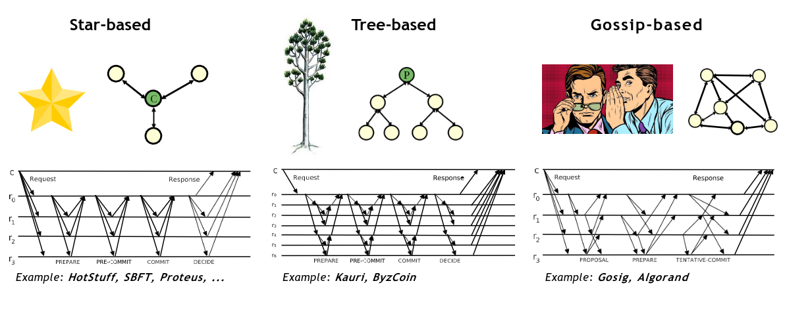

# Scalability in PBFT

Normal operation of PBFT has 2 major drawbacks regarding efficiency:
- The process of doing all-to-all broadcast is very expensive
- Leader can easily become a bottle neck

Therefore it is in our interest to improve the scalability of these types of protocols (we mostly mean maximize the number of replicas)

## Communication

Normal PBFT is of complexity $O(N^2)$

This complexity is not optimal and it would be good if we could decrease it to $O(N)$, with this being said we still want to keep message size with complexity $O(1)$ 

There are 3 main algorithms to consider: 

Start Based - Communication is done by the client to each of the replicas and between the primary and each of the replicas

Tree Based - Communication is done between the client and the primary (root) and the primary will communicate with its connected nodes, this happening between the connected nodes and its connected nodes recursively.

Gossip Based - Similar to tree based but the client communicates with all clients but the replicas communicate with their neighborhood and messages can be sent more than once to the same replica.
