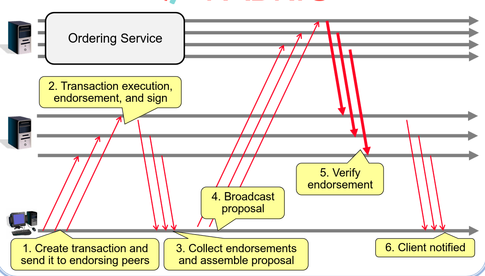

# Permissionless vs Permissioned Block Chains

| | Permissionless|Permissionoed|
|---|----|----|
| Membership Management| Anyone can Participate | Node identities must be verified|
| Consensus | POW consensus (high latency, low throughput) | BFT consensus (low latency, high throughtput)
| Finality | No, forks may happen | yes, transactions are never reversed|
| Scalability | High, thousands of participants | modest, up to 100 participants|

# Reconfiguration

During the process of running a permissioned blockchain the consortium will probably change this can lead to 2 problems:

- SMR reconfigurations are typically controlled by a centralized group
- Reconfiguring Groups my lead to forks in the blockchain

## Decentralization

To solve the first problem we must resort to making the reconfiguration protocol completly decentralized, to this effect we must implement 3 methods
- Join - which makes a node join the member of the reconfiguration protocol group
- Exclude - which removes a node form the reconfiguation protocol group, this can only be done with $f+1$ exclude requests
- Leave - which removes the node calling leave from the reconfiguration group

## Danger of Forks

To solve this problem each member of the nework must forget the old key pair after each new view, and publish its new key pair after the new view starts

# HyperLedge Fabric

The normal structer of a permissioned blockchains is:
- Inputs to state machine are totoally ordered
- Executed in some sequence, after consensus

This approach leads to some problems
- Lower performance resulting from execution latency of blocks (may conseuqnce to the existanc of gas in normal protocols)
- DOS attacks against smart contracts
- Non-Determinism which goes against the nature of smart contracts which must be deterministic (the reason some blockchains force determinism like Ethereum)
- Confidentiality of execution
- Inflexible Consensus
- Inflexible trust model

To this effect fabric models, and they needed to have 3 features
- No native critpocurrency
- Smart Contracts in general purpose languages
- Modular consensus
  
This lead to a divergence between normal models and fabric models

In traditional models
- Consensus / Atomic broadcast
- Deterministic execution
- Persist state

In Fabric Models
- Simulate Transaction and collect endorsements
- Consensus / Atomic broadcast
- Validate Endorsements
- Persist state

HyperLedge fabric is an implementation of a fabric model, it is a modular permissioned distributed operating system for blockchains, which uses
- Chaincode - Fabric counterpart for smart contracts
- Peers - Maintain the ledger  and execute chaincodes and results
- Ordering service - Creates blocks of transactions and defines their order in the ledger

In general the protocol looks like this

