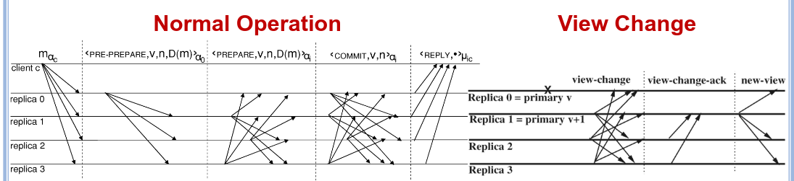
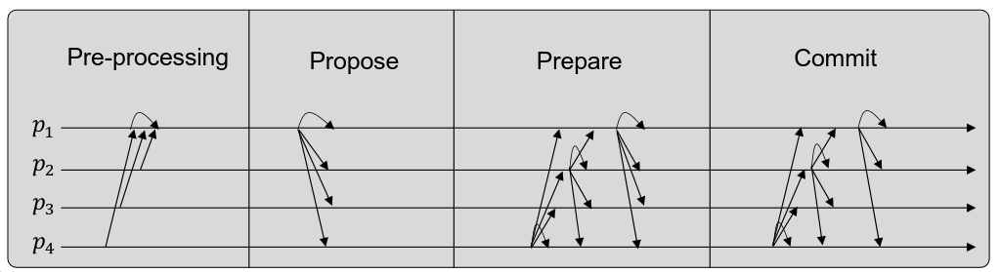
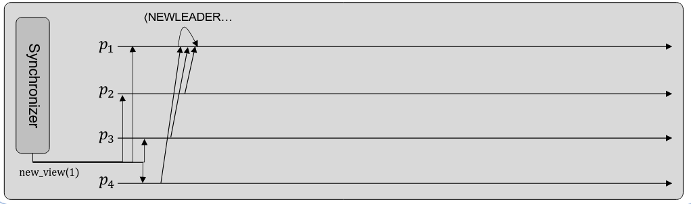
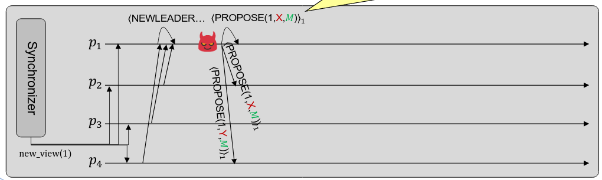
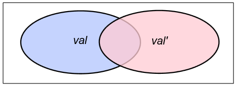
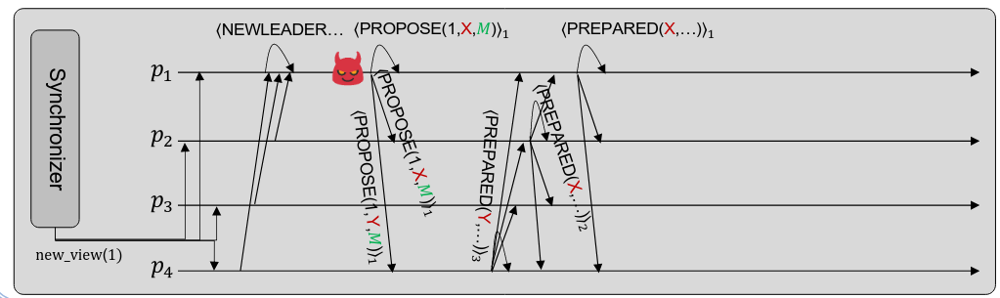
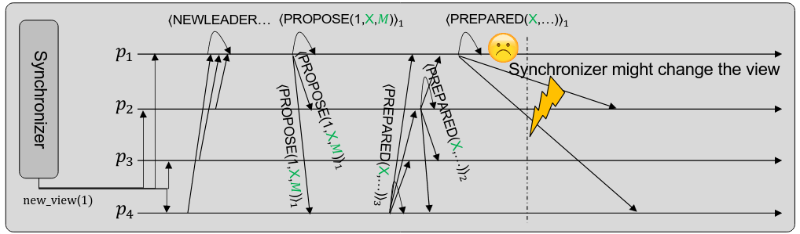
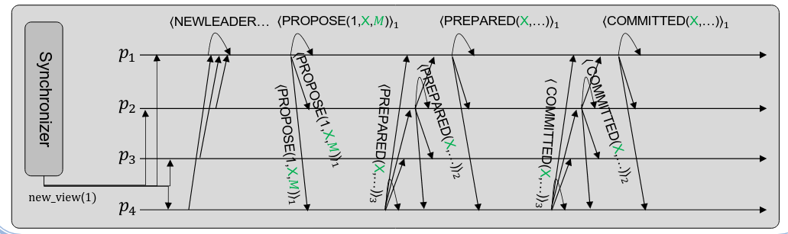

# BFT State Machine Replication

Continuing from the past class, we will now see how to actually implement BFT systems.
These systems as said previously work by keeping an order list of actions that occurred, and that all members of the system agree to be the correct order of actions.
In order for the system to agree in a correct order of actions the actions need to have some characteristics:
- Atomic Commands
- Easy Replication

We will talk now about the member of the system as replicas
Moreover the execution of the system needs to follow some requirements
1. Have an initial state which all replicas start at
2. Coordination between all replicas about the order of the execution of the commands
3. Determinism of all commands, which means that for 2 correct replicas the same command will lead to the same end state

This gives us some restrictions in programming specifically
- Request/Reply models need to used for iterations
- No local clock reads, random numbers or non deterministic functions
- No multi-threading

The general model will look like this:

And the replicas will take the state machines output and put it into their order storage

## Types of Byzantine State Machine Replication

Leader Based
- There is a primary replica that orders requests
- Imposes an order on non primary replicas
- Primary can be changed if it becomes faulty
- EX : PBFT
Decentralised
- No primary replica
- Order of requests decided in a decentralised way
- EX: RITAS

# PBFT - Practical Byzantine Fault Tolerance

PBFT is a primary based BFT SMR(State machine replication) algorithm know for being efficient and fast.
It makes usage of sequential views, in each view a server in considered the primary and others as backups
In view number v, with N servers in the system the leader is determined by:
$$Primary\;in\;view\;v=v\;mod\;N$$
## System model
- Works on asynchronous distributed systems
- Requires fair reliable channels, but it can accept if the channels fail temporarily, but not permanently
- Requires $3f+1$ replicas to tolerate $f$ faults
- Has fault Independence, therefore there aren't common mode faults
- Uses PK encryption and hashes

## Service
- It is a deterministic replicated service
- Safety - System behaves like its centralised counterpart (Linearizability)
- Liveliness - Only has liveliness if the system works in synchrony, meaning that a command made by a correct client will eventually be executed (if delay doesn't grow faster)
NOTE - Partial synchronism can also be used, meaning that the system is asynchronous, until a certain point in the future in which it will become synchronous

## Algorithm (version of 2002)

The algorithm is composed of 2 main parts
- Normal operation
- View change
There are also 2 protocols
- Checkpoint protocol
- State Transfer protocol

## Single-shot PBFT (version of 2022)

This algorithm guarantees 
- Safety - Bad things cannot happen (guaranteeing Agreement and Validity)
- Liveness - Good things will eventually happen (guaranteeing termination)

In each view the leader is decided by
$$leader(v)=p_{((v-1)mod\;n)+1}$$
For view v and n replicas

There also exists a Synchronizer which is responsible for changing view, and notifying processes that a view as ended.
It works in a timeout basis, and can interrupt the algorithm at any time, and the timeout doubles in every view if the timeout is reached.

## Algorithm

The normal operation of the algorithm has 4 stages
- Pre-Processing - Each process informs the leader of the value it has prepared from a previous view
- Propose - The Leader composes a valid proposal and sends it along with some supporting information
- Prepare - Each process communicates with the others to confirm what the leader send to them, to prevent a Byzantine leader
- Commit - Processes communicate with each other what the value to commit will be

After the commit the Synchronizer will come and pass to the next view.

### Pre-Processing
In this algorithm, if a process from a previous view was stopped by the Synchronizer before the algorithm had a chance to commit the final result, the processes will save this value to be commit in the next view.
So in this step, each process sends to the leader either, null if no value was decided or its the first view or the value decided in the previous view

### Propose
The leader proposes to each process a response value, it sends a package of the form $PROPOSE(view\_number,Value,M)$
Where M are the signed messages of other processes that they send in the Pre-processing
In this situation we notice the first case a byzantine leader can create problems. If the leader sends to each process a different value it can manipulate the vote.
This is solved in the next step

### Prepare
The processes send to the other processes the message they received from the leader and check amongst themselves if the leader is sending different messages to different processes
For this they send a package with the form $PREPARE(view,hash(current\_value))$
When other processes receive this message they compare it against what they received from the leader, and in case they are different the algorithm just stops.
In order for the process to continue the algorithm, a replica needs to receive at least a quorum of equal values to the value it holds.
A quorum in this case represents $2f$ messages for $f$ faults.
This ensures that no 2 correct processes can be preparing different values, because they wont be able to obtain a quorum. 

If any value is able to obtain a quorum of processes that agree in that value, said value is passed to the next stage

### Commit
In this step, all correct processes sent to one another the value agreed upon in the last step.
This prevent situations where the Synchronizer stops the process mid way trough.
This could lead to the situation, where some processes agreed upon an incorrect value in the last round (before a bigger number of other processes overthrew that smaller group with a bigger quorum), and when the Synchronizer stopped the process these processes passed that incorrect value to the next round, which would now be executed uncontested.
As seen below

With this in mind all processes send to one another the value they agreed to commit, so that if the Synchronizer stops the process mid way though they can be sure that the correct value will be passed to the next round

## Final Remarks about PBFT

This algorithm is therefore able to obtain

- Safety because
	- Correct processes don't prepare invalid proposals - The leader sends the proposal with some supporting information, which is able to verify the proposal
	- Correct processes prepare at most one value - If there are multiple prepared values, there would need to be one correct processes sending 2 prepared messages which is impossible
	- There can only be one committed value - A correct processes only sends a commit message if receives the same message from $2f$ other processes, and there cant be 2 messages with $2f$ processes agreeing with with in a $3f+1$ system. If there would be the case 2 quorums would intersect in $f+1$ replicas, which would mean a correct process sent out 2 different messages which is impossible

- Liveness
	- A byzantine leader can decide not to send messages, and if that happens the Synchronizer will change the view, guarantying a new leader is elected
	- We can be sure that eventually the timeout will be big enough that the system will have time to come to a consensus.

## Optimisations

The main optimisations to this algorithm are as follows
- Usage of MAC vectors instead of digital signatures - The main reason is because will MAC vectors are weaker, they are more efficiently made that signing messages
- Digest Replies (Hashing) - Because the sending of big messages can lead to a lot of strand in the network, so only one replica sends the original message to the client , the others send a hash, and the client checks the hash of the original against the hashes sent by the other replicas
- Batching - Instead of using the agreement protocol for every request, we send the protocol in batches of messages allowing for way bigger throughput in the network.