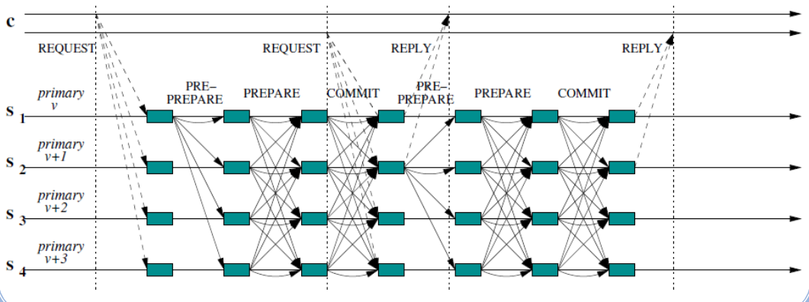

# Zyzzyva

A speculative form of BFT which leaves up to the client to tell the replicas if their state is invalid.

## Protocol 

1. Client sends to the primary the transaction it wants to execute
2. The primary orders the request and sends it to each of the replicas
3. Each replica executes the request
4. Each replica communicates the state to the client

If the state is valid
1. Client sends to each replica the commit
2. Replicas commit the transaction
3. Send to the client a response

If the state is invalid
1. Client sends to each replica a POM (Proof of Missbeahavior)
2. Correct replicas see the missbeahavior and change view
3. Correct replicas elect a new primary

## Considerations

In this protocol the client waits for $3f+1$ matching replies (or history) to check for missbeahavior.

The replicas replies are made in a speculative manner considering they don't know about the real order to requests.

While Zyzzyva is a very fast implementation of BFT, it is not perfect and has 3 main downsides:

- Speculative execution requires the ability to rollback state if a view change is triggered
- Waiting for all replies from the replicas means that we are waiting for the slowest one, if a timeout is establish the value must be calibrated properly.
- Zyzzyva is vulnerable to multiple attacks

# Attacks against BFT

Initially we must consider that all distributed protocols are vulnerable to DOS attacks, taken this into consideration we will not analyze this type of attack specifically.

Moreover, the continuos optimization of this type of algorithm has opened the door to other types of vulnerabilities.

2 of them are most noticeable:

## View change from malicious client without DOS

In BFT, clients send a request singed with their MAC address

This can be exploited by a malicious client, which can send to the primary a corrupt request, while sending to the other replicas valid requests.
This leads to the primary ignoring the request while the other replicas don't they will assume the primary has crashed or is byzantine and will change view.

### Patch
In order to solve this vulnerability we must part ways with signing with MAC addresses, and start using an alternative (like RSA).

This will inevitably have consequences on performance considering signing messages is costly.
Moreover, verifying said signatures is also a bottle neck from the server. 

## Degrading performance from faulty primary

The vulnerability stems, from a faulty primary being able to time their messages with the established timeout, and being able to send a request while waisting has much time as possible from the other replicas.

This while never exceeding the timeout. While this won't crash the service it will affect performance.

### Patch

3 main solutions exist to the vulnerability:

1. Use leader-less protocols, if no primary is defined then it won't be able to delay the system
2. Monitor the performance of the primary and change view if the performance is 2 low.
3. Rate primary periodically

# Spinning

Spinning is a protocol built upon PBFT that tries to solve it main problem, a malicious primary can order messages slowly on purpose without changing views.

Its solution to this problem is to change view after each commit message.

The main challenge with this approach is that the view change algorithm is very costly. But this is a none factor considering that the view change would have to happen anyways after each committed message.

This protocols main drawback comes from its resilience to latency, considering that its performance degrades much faster that PBFT. But this is only possible when it is the primary.

In order to recover from a faulty primary, the merge operations allows a valid primary to merge the last operations to keep the integrity of the algorithm

Thi solution also leads to a problem a faulty replica can force merge operations periodically, to mitigate this after a merge the primary of the merged view is put on a block list, limiting it from bing a primary for n views.  

# USIG and Min-BFT

Both these algorithm try to solve a common problem with PBFT, while normal BFT protocols use $3f+1$ replicas and 3 communication steps. Can we get these values down?

To this effect they make usage of certain tricks to get around this condition

## USIG - Unique Sequential Identifier Generator

USIG is a type of LTC (Local trusted component), which is a crypto-system used to authenticate outputs, which also has a monotonic counter.

This allows the generation of a unique identifier for each node of the network.
Which can at a later date be used to authenticate messages between the node and the primary.

## Min-BFT

Primary setups a USIG and communicates it to the other nodes.

This allows each node to setup a UI (Universal Identifier), this UI value is then used as a way to authenticate the messages sent from each replica.

It cant deceive the primary considering each node has a unique UI, and any byzantine behavior will be tracked down to the UI's replica.

This allows this protocol to use $2f+1$ replicas with a quorum of $f+1$.