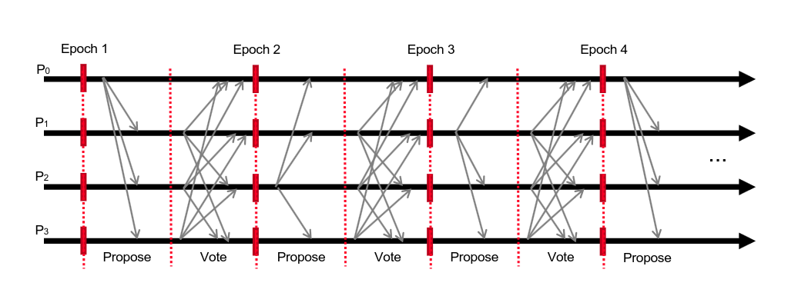
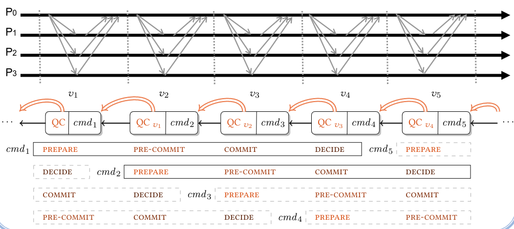
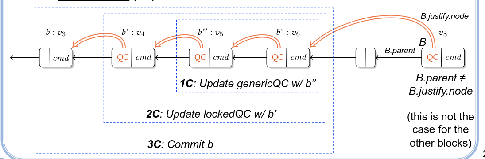

# Streamlet

Streamlet works in:
- A system with $n$ nodes, with $t < n/3$ subject to byzantine failure
- Static Corruptions- Before the system start the attacker "chooses" which nodes are corrupted
- Reliable communication
- Synchronized clock
- Partial Synchrony - Meaning there will be a moment in system execution (GST) in which, before the adversaries messages are delayed arbitrarily, and after  the messages sent by hosts are received in n rounds. 

## Protocol

Streamlet protocols runs in epochs, each epoch will be mapped to a single leader using a hash function

The protocol has 3 steps
- Epoch leader proposes block
- Each node accepts or rejects block, if accepts it then votes for it with its signature
- Epoch e is finalized/committed if the blocks for epochs e-1, e, e+1 are finalized.

## Properties

Consistency - If some honest node sees a chain of 3 blocks $B_0$, $B_1$, $B_2$ then no other block then $B_1$ can be notarized.

Liveness - Consider a chain o 5 new block, after the notarization of the final block of the chain all nodes must have observed the first block of the chain.

# HotStuff

HotStuff works in:
- A system with $n$ nodes, with $t < n/3$ subject to byzantine failure
- Reliable communication
- Partial Synchrony - Meaning there will be a moment in system execution (GST) in which, before the adversaries messages are delayed arbitrarily, and after  the messages sent by hosts are received in n rounds. 
- There is no need for synchronized clocks

HotStuff main appeal is it being a protocol which promises PBFT, with simplicity and scalability beyond what is possible with PBFT 

## Protocol

Hot stuff is implemented in a chain way.
It makes usage of QC(Quorum certificate), which is a set of signatures verifying a block.

The core rules of the protocol are, when a block is added depending on how many blocks there are before it different operations are made.
This means that different blocks will be in different stages of progress at the same time.

In the following example:
- Block b* such b*.parent = b*.justify.node makes a 1C
- if block b*.parent = b'' forms a 1C, then b* makes a 2C
- if block b*.parent = b'' and b''.parent = b' forms a 1C, then b* makes a 3C

These are applied to the diagram to know in which stage block b* is in.

Depending if the signatures of the parents of a block are on the QC, different stages can be achieved by a block. 