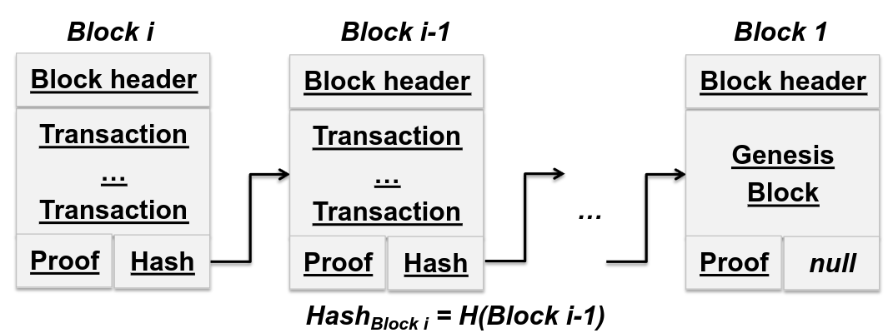
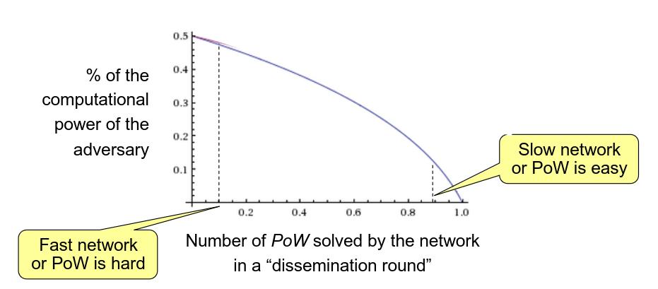

# BlockChain

As indicated before a block chain is a structure composed of blocks



Which has 3 main properties:
- Integrity
- Auditability
- Non-repudiation

Meaning that it doesn't allow a malicious party to:
- Inset/Modify a block in the chain
- Delete a block in the chain
- Invalidate or repudiate a change to the chain

These block chain are the basis for the implementation of transaction ledgers, these ledgers are distributed, and as so each member of the system has a copy of the ledgers, which should be kept updated with all other copies.

A protocols objective will therefore be to implement a public transaction ledger which has 2 properties:
- Persistance - If member A has a ledger with transaction tx in a block with k more positions than the end of the chain, then tx will be present in the same position the all chain of all honest members.
- Liveness - If a valid transaction tx is sent to all honest parties, then there exists an honest party which will report tx in the chian in the same position.

# Permissionless vs Permissioned Ledgers

This leads to 2 main types of ledgers which can be made

Permissionless
- Each party only knows part of the network
- Participants fluctuate
- Each party can have multiple identities
- Susceptible to Sybil attacks
- Communication based on P2P

Permissioned
- To participate in the network must have a verified identification
- Not required to scale infinitely
- Uses normal byzantine protocols
- Normal use for business 


# Nakamoto Consensus

Backbone of the bitcoin protocol

Key features

- A block is added to the chain after a cryptographic puzzle is solved
- New blocks are dissimilated in a P2P network
- If multiple proposals to extend the chain are received the longest is used

## System model

Nakamoto consensus works upon a specific type of system which come properties

- Synchronous distributed system with n processes
- Protocol with synchronous rounds, where at most t out of n members are subject to byzantine failure
- Static corruptions
- Reliable broadcasts
- Every party has a limited amount of queries to the hash function

## Functions and Storage

Each member of the network has a local state, which will be a copy of the block chain and can use 3 methods

- C = ``` maxvalid(C,C') ``` , used when a new chain is received and compares 2 chain and chooses the longest to be the valid one (with valid hashes)
- C = ``` proof-of-work(C,txs) ```, solves the cryptographic puzzle of a block contained transaction txs and the hash of the previous block
- BroadCast(C) 
- Return transactions of C

## Proof of work

Proof of work is made by for a certain block m using the hash function SHA256-HASH of the block, and changing the block until a hash is found the starts with a number n of zero's.
Mining bitcoin is therefore trying to solve this problem efficiently, normally to solve this problem once takes about 10 minutes for the whole network.

## Protocol Properties

Consistency - At any point in the chain of 2 honest parties can only differ in the last k blocks

Future Consistency - At any 2 points r and s, the chains of an honest member at r can only differ from s in k blocks

Chain growth - At any point the chain of an honest member grows by at least k messages in the last k/g rounds

Chain quality - For any k consecutive blocks in any chain by a honest party, the fraction of blocks by honest parties is at least greater than $1/2$

## Protocol Security

This protocol only works if the adversary controls less than half of the computational power.

The more the computational power the adversary owns the less POW we are able to do per round.

With this in mind there are 2 approaches

- slow down the network - Slower network less likely the attacker is of proposing a block at the same time as a valid user
- make POW easier - Allow less computational power to be required to make a block, making it more difficult for the attacker to invalidate a new block

Considering neither of these is favorable the difficulty of the POW and the speed of the network must be tweaked to match the specific requirements.

