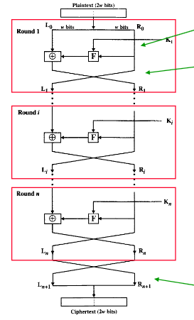
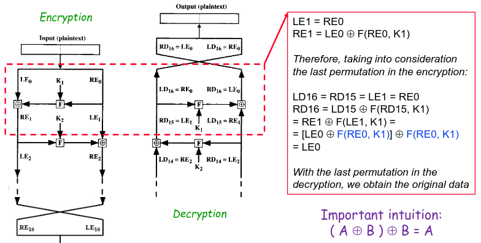
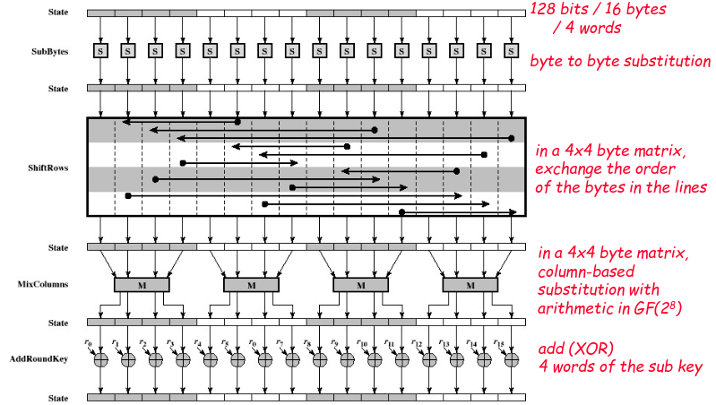

# Symmetric Encryption

Encryption algorithms are a type of algorithm in which we turn normal text data into cipher-text.
This is normally done in order to conceal the raw information from unauthorized parties.

To this effect this type of algorithm can be characterized according to multiple factors

Operations:
- Substitution
- Transposition
- Mathematical Operation

Number of Keys:
- Symmetric Cipher: 1 key
- Asymmetric Cipher: 2 keys

How the plain text in processed
- Block Cipher
- Stream Cipher

When considering this type of algorithm there are 2 main assumptions we must consider
- The attacker has access to all encrypted data
- The attacker knows the details of the encryption/decryption function

Taking this into consideration our algorithm are solely dependant of key size and algorithm quality

Poor key size will lead to vulnerability to brute force attacks

Poor algorithm quality will lead to vulnerability to CryptoAnalysis (means using the nature of the algorithm and some knowledge of the plaintext to try to discover the original plaintext or the key).

All of these leads us to 2 categories of algorithm regarding security
- Unconditionally safe - Where the generated cipher-text doesn't have enough information to uniquely identify the plaintext
- Computationally safe - Where the cost of breaking surpasses the value of the information **or** the time required to break surpasses the lifetime of the information

## Encryption with Symmetric Key

In Symmetric key encryption both side have access to the same symmetric key.

And as such the send both messages encrypted with it in a way only someone with the symmetric key could decrypt.

To this effect they need a function such that

$$D_k(E_k(M)) = M$$

## Block Ciphers

Block ciphers are a type of encryption algorithm in which we use and encryption method that transforms a block of n bits into another block of n bits.

Given any block of n bits can be turned into $2^n$ other blocks, encryption is based on the difficulty to undo this operation.

The conjunctive operation of transformation all blocks in the message leads us to $2^n!$ possible messages.

To this effect we need to choose the value of n accordingly.

In practice not all $2^n$ possible blocks will be used, and this value falls closer to $2^k$ which is a subset.

There are 4 main types of operations we can use to convert blocks:
- Substitution ciphers - Substitutes and element by another
- Transposition ciphers - Rearrange the order of the elements
- Product cipher - Combines both Substitution and Transposition ciphers
- Feistel cipher - Repeats the product of ciphers based on basic transformations

### Feistel Cipher

As we can see in the image in a feistel cipher we use the cipher function only in one of the halves of the block, and use the output of the function to $XOR$ it with the other halve.

This 2 halves are then switched around, and the process is done all over again but using the other halve as the function input.

Lastly we rearrange them to the original positions, for easier decryption.

It is crucial to know that 
s
$$(A\;XOR\;B)XOR\;B=A$$

This algorithm more than having only block size, is also defined by having J number of rounds.

To choose the number of rounds we must make an analysis based on the cryptanalytic effort, so that the algorithm is difficult to analyze.

Moreover we can also see that we are using keys from $K_0...K_J$, considering it isn't practical to use multiple keys in a connection these keys are usually based on a key generator, which is a structure which after receiving a key returns a stream of subsequent keys.

### DES (Data Encryption Standard)

Similar to Feistel cipher but more developed into an usable algorithm.

In a nutshell the changes are
- Blocks with 64 bits
- Key with 56 bits
- Algorithm with 16 iterations
- Function based on permutation and substitution

Some variants of these algorithm also exist

Double DES, where grouping keys became standard.

Group key are when $EK2(EK1(P))=EK3(P)$ if this is the case brute force attacks became harder to do

Triple DES, similar to Double DES but grouping in done by $C = EK3(DK2(EK1(P)))$ $P = DK1(EK2(DK3(C)))$

### AES (Advanced Encryption Standard)

AES is another Feistel based algorithm which comes as a successor to DES.

It has a significant change in comparison, the usage of diffusion.

The algorithm goes as follows
- Key Expansion
  1. Derivation of round keys using AES key schedule. The algorythm requires a 128-bit round key block to be used.
- Initial Round Key addition
  1. AddRoundKey - Each byte is combined with the round key using XOR
  2. SubBytes - Each byte is replaced with another byte accordingly to the lookup table matrix
  3. Shift Rows - Transposition where the last three rows are shifted a certain number of steps
  4. Mix Columns - Linear mixing which operates over the columns of the state, combining the final four bytes of the column.
- Final Round
  1. SubBytes
  2. ShiftRows
  3. AddRoundKey

We can see the algorithm clearly in the image

One of the interesting features of this algorithm is that it can operate in different modes, with different results.

Some of the modes are ECB (Electronic CodeBook), CBC (Cipher Block Chaining), CFB (Cipher FeedBack), ODB (Output FeedBack) and CTR (Counter).

# Stream Ciphers

Stream ciphers come as sequence of block ciphers with one main difference, instead of encrypting based on blocks we encrypt based on individual symbols.

The main advantages are that these algorithms are usually:
- Simpler and Faster
- More memory efficient
- With very small error propagation

This being said they have some major downsides
- Can lead to inefficient software implementations if not considered properly
- Usually secret considering their proprietary usage
- More easily criptoanalized

For these algorithms to work they need a continuos stream of keys, to this effect we needed KeyStream Generators.
These are structers which create a long sequence of bits which has a large period, these can be interperted as a true random.

# Pseudo Random Numbers

Many applications resort to random numbers as a source of security.

The create of random numbers needs to follow some characteristics:
- Uniform Distribution - Frequency of 0's and 1's msut be similar
- Independence - A subsequence cannot be inferred from other subsequences
- Unpredictability - The sucessive elements of a sequence must be produced to be unpredicatble based on one another

This leads us to 3 categories of Random Number Generators
- True RNG - Usually uses a outside source of randomness
- Pseudo RNG - Doesn't use real randomness
- Pseudo Random RNG - Uses outside source of randomness in combination with unreal randomness

To this effect the charecterisitcs we need in a RNG are:
- Uniformity - Frequency of 0's and 1's msut be similar
- Scalability - If a sequence is random, anny subsequence will also be random
- Consistency - The results of the generator are consistent across multiple starting values (seeds)
- Forwards unpredictability - Previous bits can't be used to predict future bits 
- Backwards unpredictability - The seed cannot be obtained from the generated values

# Summary

Based on this we can conclude that when pondering an cryptograpfic solution to a problem there are some factors we must take into account that are paramount to security
- Key size
- Key lifetime
- Randomness of generated values
- Cryptographic Algorithm