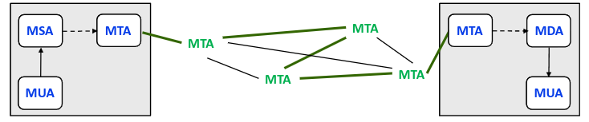
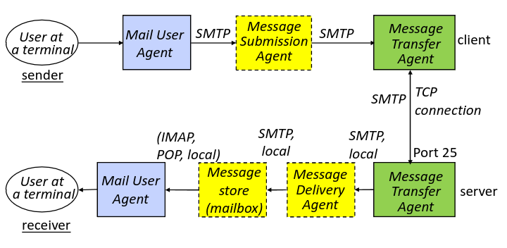
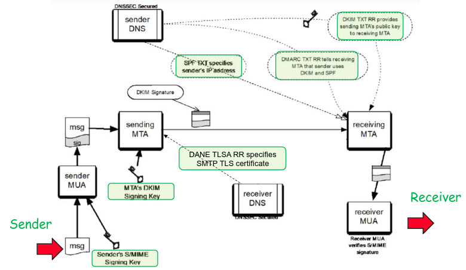

# Secure Electronic Email

## Service Model

Normal email services are composed of 4 different components:
- MUA (Mail User Agent) - Its purpose is to allow an end user access to a mailbox and to write and read email from remote mailbox, it is also responsible to transfer emails to/from the server 
- MTA (Mail Transfer Agent) - Its purpose is to transfer emails between servers, and to forward messages between mailboxes using SMTP
- MSA (Mail Submission Agent) - Similar to MTA but responsible for receiving emails from the MUA and sending them to the MTA for forwarding
- MDA (Mail Delivery Agent) - Similar to the MSA but instead of sending to MTA receives from MTA

The purpose of MTA in comparison to just using MUA is because of the possibility that different users use different protocols and so that the users don't need to be online at the same time for a message to be sent, given the MUA is only available when the user is online.

### Distribution Lists

Distribution lists are another part of the email protocol and are used when we want to send a message to multiple users.

There are 2 main approaches to distribution lists:
- Local - The user is responsible to "explode" the message and send it individually to each of the other users.
  1. Prevents distribution loops
  2. Prevents duplicate emails
- Remote - The users sends the message to a distribution list maintainer, which then "explodes" the list and sends it to each user
  1. Keeps confidentiality of the members of a list
  2. More efficient for bigger lists

## Guarantees of a email service

Some guarantees we want out of our service are:
- Confidentiality
- Authentication
- Integrity
- Non-Repudiation
- Proof of Submission
- Proof of Delivery

### Confidentiality

The main scenarios where confidentiality can be broken will be:
- Message read while in transit
- Message read while in MTA, if the MTA stores a copy

To protect against this we have 2 alternatives:
- Encrypt the message with a session key
- Encrypt the session key with the receivers public key

Both of these methods should also be applied to distribution lists:
- If local the user needs to keep a key with every user it wants to communicate with
- If remove the users keeps a key with the maintainer, and the maintainer keeps a key with each user 

### Authentication

If done with public key, we can just create an hash with the private key of the sender and the receiver can verify it with the public key

If done with symmetric key, we are assured that only someone with the symmetric key can have made the hash therefore, if we only keep one key between users we can rest assured of authenticity

In the situation of distribution lists:
- Is simple with public key, the list keeps a private key and the users can use its public key to verify
- With symmetric key it will require the list to keep a symmetric key with each user

### Integrity

Whenever we guarantee authentication we also guarantee integrity, to this effect the same conditions apply:
- Symmetric key is difficult given we have to setup a shared key between receiver and sender
- Public key is simpler given each receiver only needs one key pair

In order to achieve integrity we will use a hash calculated with the public key of the receiver

### Non-Repudiation

The objective will be for a receiver to know the identity of the sender and to prove to a third party that the message came from the sender.

Using public keys is simple, given a single public key is associated with a single user

Using symmetric keys is impossible unless we resort to a notary which is trusted by both parties, and whose job will be to keep a seal that is made in the sender and to compare it to a seal which is passed on to him by the receiver. By verifying the seals he can verify the message was sent by sender and received by the receiver.

### Proof of Submission and Delivery

Proof of submission can be made by the MTA and therefore can keep information like message and date in a receipt.

Proof of delivery is impossible without cooperation from the receiver.

Given the receiver needs to create a receipt after it receives and reads the information, unless the receiver signs the message and confirms he read it it is impossible to create this receipt.

# Email Systems

## SMTP

Protocol:

- Client MTA connects to server MTA
- Server MTA sends ID and that is ready to receive
- Client MTA indicates sender and receiver address
- Server MTA indicates the message can be transmitted if receiver exists
- Client MTA sends the message
- When Client MTA doesn't have more messages it closes the connection

## MIME (Multipurpose Internet Mail Expansion)

Comes in sequence of RFC a successor to SMTP

The main differences added in RFC which continued to be used in MIME were:
- Message envelope - Encapsulates message with all transmission information
- Adds a header and body field to the message

MIME continued the protocol of RFC but expanded it to allow for more types of characters and resolved problems in RFC like truncating message size in servers

# Sender Policy Framework

SPF is normally used to defend against spoofing and fishing attacks, it does this by allowing checks to be made base on the email and domain on received messages

The information regarding the IP and email can be obtained from the header of the message, and the domain can be obtained by query the DNS service.

It does this by verifying when a message is received that either the IP of the message corresponds to the the correct DNS domain or that there isn't a valid SPF in use for that email address.

If both these checks are verified, then the message is processed as usual.
If either fails the message is quarantined.

While this doesn't solve all attack scenarios it is very effective.

# DomainKeys Identified Email

DKIM or DomainKeys Identified Email is a way for a certain email address to take responsability over a message by signing it with a private key.

DKIM is normally used by entreprises to solve the problem of an attacker impersonating a company.

To this effect DKIM signs both the header and the body of the email with its private key, and places in the header info about the protocol and key selector used.

The receiver can then use DNS entrprise system to get the public key for that specific entreprise which will then be used to decrypt the message.

## Protocol

Setup is done by an admin which needs to generate a key pair, and publish it to DKIM record in DNS

The when in usage the key, which belongs to the domain, is used to sign the message.
This signature will protect the body and the headers from tampering

# DMARC

DMARC or Domain Based Authentication, Reporting and Confidence tries to resolve a problem in DKIM and SPF which revolves around information regarding email usage and possible attack defense

Therefore the main goal of DMAR will be to institute mechanisms in place which:
- Let users know how to verify email
- Indicate users which actions must be taken in attack scenarios
- Returns report about the effectviness of DKIN and SPF

The main tradeoff comes from the careful configuration required by DMARC

# STARTTLS

The main purpose of STARTTLS is to allow MSA/MTA/MDA to use TLS to setup connections

The protocol goes:
- The server advertises STARTTLS is available for usage
- The client indicates it wants to use STARTTLS
- The 2 parties setup TLS connection

Some limitations come from:
- being optional
- Downgrade attacks
- failures in certification authentication

In order to distribute certificates accross the servers DANE (DNS-Based Authentication of Named Entities) is used

# Secure MIME

Secure MIME or S/MIME purpose is to allow a user to assert the owner of a certain message, it does this by allowing the signing and encryption of messages

When starting S/MIME sends indication about 3 attributes
- Signing time attribute - Timestamp of when the message was signed
- Cryptographic attribute - indicates which cryptographic algorithms are allowed
- Key preference - Indicates which certificate type should be used

S/MIME allows for 4 methods
- Clear signed data
- Signed and Enveloped data

## Encryption

Also called enveloped data

Protocol goes:
- Generate encryption session key
- Encrypt session key with receiver public key
- Prepare RecipientInfo, which stores
  1. Receiver certificate
  2. Encryption algorithm
  3. Encrypted session key
- Encrypt message with session key
- Encode message and RecipientInfo in base64 to send

## Signing

Also called signed data

Protocol goes:
- Select hash algorithm
- Compute hash of the data, and encrypt hash with senders private key
- Prepare SignerInfo, which stores
  1. Certificate of sender
  2. Cryptografic algorithm
  3. Signature
- Encode SignerInfo, message data and potential certificate chain in base64 to send

# All of this can be put together into this amalgamation
