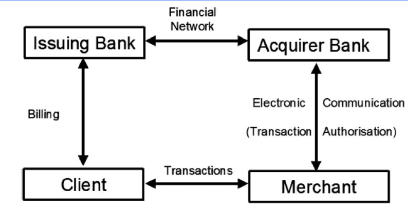

# Electronic Payment methods

The motivation for this type of system is easily apparent

But the requirements of such a system are more complex:
- security - to protect from theft
- availability - address DOS attacks and avoid single point of failure
- flexible - to allow multiple forms of payment
- scalable - avoid performance bottle necks
- unobtrusive - the user shouldn't be hassled
- integration - seamless integration with external payment infrastructures

There are 2 main classes of payment methods
- Account Transfer - based on transferring money between accounts
- Electronic Cash - based on coins with monetary value that are stored in computers

# Card Based Systems

Normally transactions are dependant on 4 entities:
- Client
- Merchant
- Acquiring Bank
- Issuer Bank

These will communicate with each other to try to transfer funds from the client to the merchant

Organization like Visa and MasterCard don't involves themselves directly they are only responsible for supporting the Acquiring and Issuer Bank in clearing transactions. They are not responsible for creating the cards.

Over the year many alterations were made to cards
- Adding checksums
- Adding metal bands

All of these standards were eventually combined into the EMV (EuroPay-MasterCard-Visa) to try to standardize cards and focus in the development of some areas like:
- Take advantage of tamper-resistance capabilities of cards to store secrets
- Explore the capabilities of the card processor

## Usage of EMV

In a certain transaction (usage of EMV) some steps need to occur

The user getting a card from the issuing bank, which is used to select a subset of the EMV protocols which it will use

The merchant which will buy EMV compliant hardware and connect it to the banking service.

And the we will have 3 phases of the transaction

### Card Authentication

Starts by giving information about the issuing bank, and makes sure the card data has not been tampered.

During this step:
- Terminal selects operation mode (credit, debit, ...)
- Terminal checks resident data to look for tampering
- Terminal decides on online verification or offline

There are 3 methods for checking for tampering, or data authentication:
- Static Data Authentication - Confirm integrity of Static Application Data
- Dynamic Data Authentication - Confirm the integrity of Card Resident Data
- Combined Data Authentication - Combination of the 2 above

### CardHolder Verification

Terminal checks that the user is the owner of the card normally by resorting to a PIN or signature

The verification can be:
- Online - The terminal checks the PIN with the Bank
- Offline - The terminal checks the PIN with the card (the card responds with yes or no and the number of attempts left)

### Transaction Authorization

Ensures that the Bank allows the transaction to go through

The process goes:
- The terminal asks the card if the transaction is authorized
- The card determines if the transaction is authorized and creates a MAC using symmetric key shared with the issuer bank, and sends it to the terminal
- The terminal sends the MAC to the bank
- The issuer bank informs the terminal if the transaction is authorized or not
- The card is contacted again to make sure the transaction is authorized
- The terminal executes the transaction and informs the bank

This can also be done off-line, where the terminal doesn't inform the bank

# ELECTRONIC CASH PAYMENT SYSTEMS (Bitcoin)

