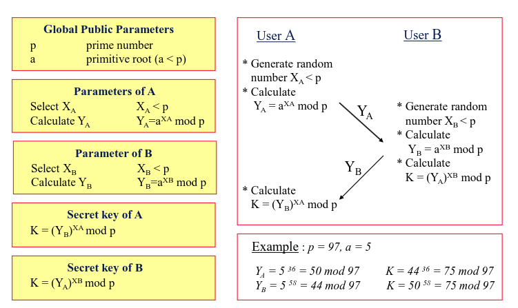
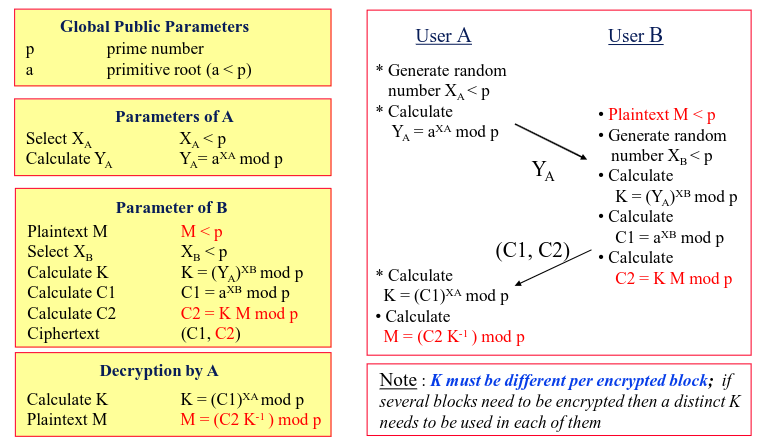
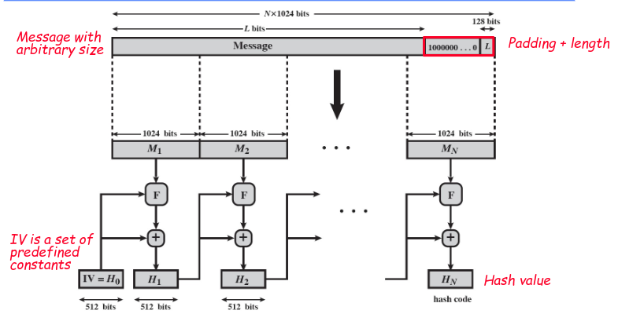

# Asymmetric Encryption

Asymetric algorythm are the counterpart to symmetric algorythm, and unlike their conterparts have more nuances.

These algorythms have 3 main areas of usage
- Encryption/Decryption
- Digital Signature
- Key Exchange

But not all algorithms can be used for all these areas

Taking this into consideration, not one type of encryption is superior to another.

They are just more suited to some specific situations.

Normally asymmetric algorithms have some conditions they need to fullfil
- It needs to be computationally easy for a key pair to be generated
- It needs to be computationally easy for a sender A to create a cipher-text based on a key and a plain text.
- It needs to be computationally easy for a receiver B to decrypt a cipher text if it has the key, and obtain the original message
- It needs to be computationally infeasible for an adversary to determine the private key based on the public key
- It needs to be computationally infeasible for an adversary to get the original text if it has the cipher-text and the public key
- It should be done that the keys can be applied in any order

There are some vulnerability scenarios that can happen to this algorithm
- Given public keys are vulnerable to brute-force attacks, we should strive to use large public keys, but that are small enough to still be practical
- It hasn't been proven that we can compute private keys from public keys so this is a possible attack scenario
- Finally we have probable message attack, in which we compute the encryption for all possible messages, this works better in smaller message sizes.

## RSA

RSA is an algorithm which is based on the complexity of given a large number compute the primes which multipled give said numbers, also called discrete logarithm calculations.

In this situation our private and public key, will be both primes.

We initially chose p and q such that $n = pq$ we then use $\phi(n) = (p-1)(q-1)$ to obtain all the relative primes of n bellow n.

We then select e such that $gcd(\phi(n),e)=1 and so that $1<e<\phi(n)$

Finally we calculate $d=e{-1}\;mod\;\phi(n)$

To encrypt the message we will do 

$$C = M^e \; mod \; n$$

and to decrypt we have

$$M = C^d \; mod \; n$$

In terms of security there are 3 main attack scenarios which can be used for this algorithm

- Timing attacks - Using the duration of operations to try to predict which operation was performed, this can be used to detect certain types of keys that are being used
- Brute Force attacks - Trying all possible combinations of p and q to see if we can crack the key
- Mathematical Attacks - Trying to predict p or q based on the other value, using mathematical equations.

## Diffie Hellman

Diffie hellman is a key exchange protocol which uses RSA to transfer keys across an insecure channel securely, with both sides being able to derive the same key without it needing to be explicitly sent.

To this effect the algorithm goes as follows :
- We have global variables, p a prime number and a a primitive number which $a < p$
- Then A
  1. Generates a random number $X_A < p$
  2. Calculates $Y_A = a^{X_A}mod\;p$
  3. Sends to B $Y_A$
- Then B
  1. Generates a random number $X_B < p$
  2. Calculates $Y_B = a^{X_B}mod\;p$
  3. Calculates $K = Y_A^{X_B}mod\;p$
- Then A
  1. Calculates $K = Y_B^{X_A}mod\;p$

This allows both A and B to obtain K without it never being explicitly send between themselves

All things considered this algorithm is vulnerable to a type of attack called Man In The Middle (MITM), this occurs given we aren't authenticating either part of the transaction and to this effect if an attacker were to position themselves between A and B, allowing him to exstablish a key with A preteinding to be B and the same with B pretending to be A.

This would allow him to eavesdrop and maniuplate messages sent from A to B.

This can be solved by storing the values of $Y_A$ and $Y_B$ in a common shared directory, which would allow A to know that if he is talking to B he is expceted to send messages using a key derivated from $Y_B$.

The algorithm can be seen bellow.

In current days 2 upgrades were made to this algorithm Elgamal and Elliptic curve

Elliptic Curve is an alternative way of using DH where p an q aren't prime values but solutions to a complex mathematical problem. The main advantage of this algorithm is that their solutions are simpleer and therefore easier to produce and send. 

This allows for greater effieciency in the process of encryption and decryption and reducing compautional effort of the entire problem.

Elgamal is an alternative algorith in which insted of setting up a single key, we setup a key and use it to derivate subsequential "session" keys. This solves a bring problem with DH that being that the simplicity of keys can lead to easier brute force attacks

# Hashing Algorithm

A hash function is a function that given an amount of data returns an output of a fixed size that represents the original data, also called an hash.

Hash functions have 3 main properties:
- Given M we can compute $H(M) = h$ where h has a fixed size
- Given h it is very difficult to obtain X so that $H(X) = h$
- Given M it is very difficult to find M so $H(M) = H(X)$

This type of function has 3 main types of attacks
- Birthday Attacks - Attacks where given X and h' which is an alternative version of h which is $h=H(X)$, an attacker tries to finds X' that can be used to create h'. This allows an attacker to be able to have an alternative copy of X with normally malicious intent.
- Brute Force Attacks - Given an hash with n bits there are only $2^n$ combinations which depending on n can be easily brute forced to find the original content
- Cryptanalysis - Can be used to find a collision in the hash function, usually cryptoanalysis is the best way to do this. 

## SHA (Secure Hash Algorithm)

Is an implementation of a hash function with many versions.

The main differences between versions usually stem from
- Hash size
- Message size
- Block size
- Word size
- Number of Steps

SHA functions in a sequential manner not unlike some of the modes of AES, the main difference stems from the fact that in AES we are getting a similar size, here we are compressing the input.

Moreover we also don't need to undo the hash so there is no need for the reverse operation

# MAC (Message Authentication Codes)

MAC's are normally used as defense for some specific attack scenarios
- Insertion of messages from fraudulent source
- Arbitrary changes to content
- Modification of message sequence
- Replay or delay of messages

Alternative methods exist to solve this problems, but all things considered MAC's are a very good solution.

In a general sense MAC's are created by:
- MAC = $H(M||K)$
- Use block cipher
- MAC = $E_K(H(M))$

Then when the message is decrypted the MAC can be verified using the original key. This is normally done by comparing the original MAC and the hash of received message. 

