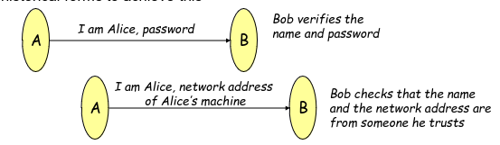
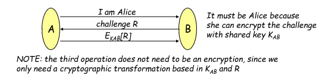
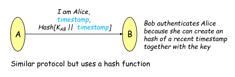
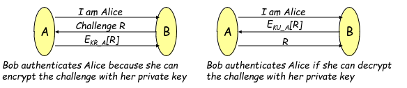
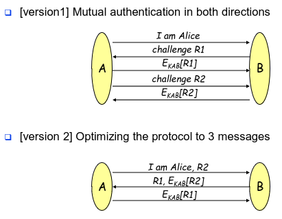
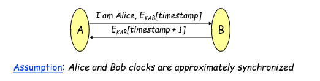
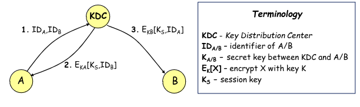
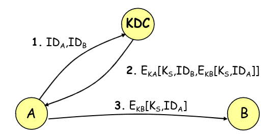

# Authentication and Key Distribution

The goal of authentication is to allow a component to know who he is talking to, and eventually allow the creation of a shared session key.

There are multiple types of authentication

Generally speaking there isn't a "best" type of authentication, it is dependant on context and each protocol has ups and downs sides.

We must also take into consideration possible attack scenarios when pondering the protocol we should use:
- Eavesdrop attack - Allows attacker to see message contents
- Personification Attack- Allows an attacker to convince Bob that he is Alice.
- Fake network address of Bob - Allows an attacker to convince Alice that he is Bob
- Read Secrets - Similar to Eavesdrop, we personificate Bob/Alice to Alice/Bob so that we can read the messages sent in the connection
- Change Messages - Place himself between Bob and Alice and read and alter messages sent in the connection.

These are just some of the attack vectors, combinations of these are limitless and can lead to new possible attacks.

## Unilateral Authentication

This type of authentication only assures the identity of the initiating party.

There are 2 main ways of doing this type:
- Password based
- Network address based

There are severe downsides to this method
- Both methods can be circumvented if the password is leaked, or if someone uses Alice's network address
- Alice is not authenticating Bob

## Unilateral Authentication with Shared Secret

Similar to Unilateral Authentication with another step, where Bob sends to Alice a challenge with the intent of verifying that the other party communicating is really Alice

This is usully done by resorting to a criptografic problem that only alice has the correct key to solve.

Even thought better this aproach still leaves some problems:
- Given we aren't using this key to encrypt all messages, an attacker can still hijack the connection after alice authenticates herself
- Alice still doesn't authenticate Bob
- Allows for off-line attacks where Malory listens to $E_{KAB}$ and decrypts it off-line for further use.

Some of these problems are solved if Bob resorts to different challenges everytime a new conncetion is made, but not all.

Alternative version of the algorithm doesn't resort to nonce as a challenge, instead uses a timestamp

Bob authenticates Alice given she is the only one which can make the hash of the timestamp with the proper key, and also validates she is really speaking with alice at the correct moment give the timestamp validates time.

This as some advantages in comparison:
- Less code from Bob's side given it doesnt need to store secrets
- This kind of authentication is simple to use in RPC methods

But still doesn't solve some of our problems
- If the adversary is fast it can reuse previosly sent messages before the timestamp inside them stops being valid
- If an adversary can change Bob's clock time it can manipulate it to allow older timestamps, therefore this method is dependant on synchronization algorythms

The shared secret in question can be easily changed for a public-private key dynamic allowing for better security at the cost of exposing the service to a new type of attack

In this situation an attacker can ask both Alice and Bob to sign messages with their private keys before hand, and use them to fool Bob and Alice respectively at another time

## Mutual Authentication

Mutual Authentication is the direct consequence of what we saw above, basically we use unilateral authentication but for both sides.

This allows us to authenticate both Alice and Bob.

A simplified version can be seen bellow, but a new attack scenario occurs from this simplification.

In a nutshell:
- Alice sends to Bob R2
- Bob sends to Alice R1 and $E_{KAB}(R2)$
- Malory sends to Bob R1
- Bob sends to Malory R3 and $E_{KAB}(R1)$
- Malory completes Alice's authentication with Bob by sending $E_{KAB}(R1)$

This is called a reflection attack

There are 2 solutions to this problem:
- Use different keys to authenticate Bob and Alice
- Use challenges with different formats, like odd challenges one way and even the other.

## Mutual Authentication with Timestamp

Similarly to above we can use timestamps in our message to further authenticate both alice and bob.

To this effect instead of using R1 and R2 as challenges we just use a timestamp and use it to verify both timeliness and the identity of the other party.

## Mutual Authentication with public key

Similarly to above we can use public keys in our message to further authenticate both alice and bob.

All the problems not related with unilateral communication still maintain themselves.

To this effect some new problems arise when using this method
- How are public keys obtained
- How do we pass the public key from alice to alice's machine (given alice is the one that knows the password)

## Mediated Authentication

Our final method tries to solve on of the problem with public key, how are keys distributed.

In this situation we have an entity KDC (Key Distribution Center), which is a trusted entity and is responsible to keep the public keys of the other members.

In this algorithm we use assymetric key encryption to encrypt our data, and use the public key obtained from the KDC to o do the encryption step.

the algorithm foes as follows:
- Alice asks for Bob's public key from KDC, by sending Bob's ID and Her ID
- KDC returns alice a message, which she can decrypt to get bob's ID, a session key and the ticket
- Alice sends to bob the ticket

A ticket has the form of $E_{K_B}[K_S,ID_A]$

