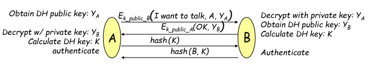
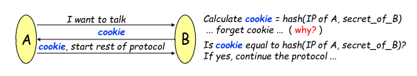
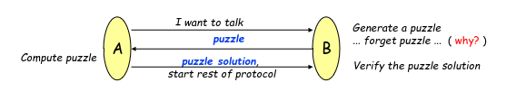

# Authentication Protocols

Consider a protocol that starts by authenticating both sides of the connection and that results in the creation of a session key

To this effect messages thereafter will have the following format

Session Key + Encryption of message + MAC + Sequence Number

Allowing for:
- Confidentiality
- Integrity
- Defense against replay and reordering attacks
- Defense against session hijacking

## PFS (Perfect Forward Secrecy)

PFS is a characteristic of a connection that is true if it is impossible for ana attacker to decrypt a conversation even if :
- she records the entire conversation
- and at a later data breaks both long term secrets of the communicating parties

To be able to do this we must use a temporary session key which should be derived from local information and which is forgotten after the channel closes.

Given that these keys can still be compromised it is also recommended to periodically switch temporary keys.

This defense is particularly effective if an attacker has already obtained the long term secrets of both parties.

## Denial of Service Protection

In denial of service attacks, an attacker prevents correct hosts from using a service by making a server use his resources with authentication attempts.

To this effect 2 solutions are proposed

Usage of cookies as a defense, is done be requiring the sender to respond with a cookie before the connection continues

given cookies are easy to produce computationaly, these can be used to verify the continuation of the connection by the sender, and discourage some DOS attacks.

Usage ofPuzzles as a defense is similar to cookies, but adds another level of dificulty given the sender will have to use resources to solve the puzzle before the connection is continued.

for a singular user this isn't a problem, but for a DOS attack this will be equally if not more costly than to the server.

All of these approaches should only be used if the server is seeing evidences of a DOS attack. Normally when the server is getting a lot of traffic with small load per connection or lots of authentication attempts.

**--TODO DO the rest of the slides if u have time**