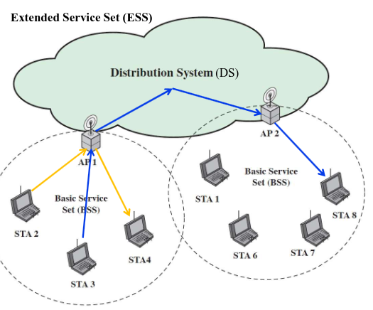
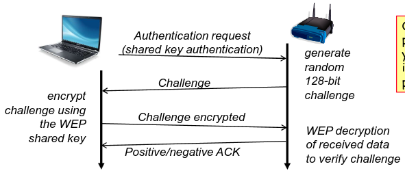
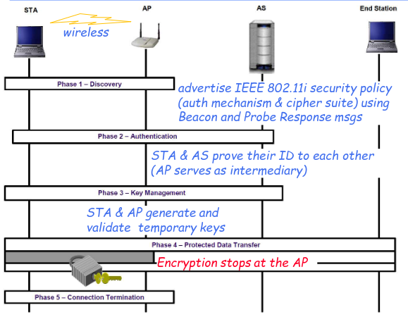
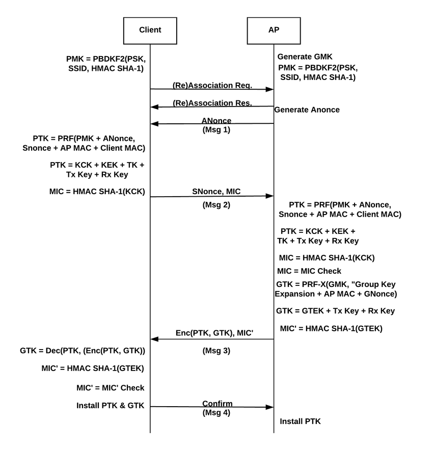
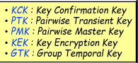
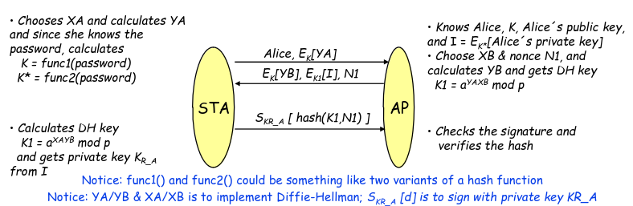

# IEEE 802.11

IEEE 802.11 started out as a protocol for communication in local area wireless networks, its main appeal was the fact that a packet could be sent through a wireless network in the same way it would pass through the Ethernet.

There are 3 architectural types for this network:
- IBSS
- BSS
- ESS

Communication is done based on AP(Access Points), in the absence of AP's stations communicate directly amongst each other.

## Security Objectives

The main goal of this protocol were
- Ensure confidentiality of communication
- Ensure integrity of packages in the network
- Ensure availability of resources
- Restrict access of devices to only permitted members of the network

## Threats

Given access is allowed to anyone in range of an AP, this is an attack vector we must consider

Depending on the complexity of the configuration, problems may arise

# Pre-Robust Security Networks

With these security requirements in mind, there was a need for an implementation of IEEE which could fullfil them.

These leads us to WEP (Wired Equivalent Privacy), it was made with the intent to simulate the low level trust of a wire network in a wireless environment.

Initially an external key management service is used to setup a shared key

Then 2 modes of operation can be used:
- Open system authentication, in which no authentication is used other than MAC addresses
- Shared Key authentication which follows
  1. Client -> Authentication Request
  2. Server -> Challenge
  3. Client -> Encrypted challenge
  4. Server -> Positive/Negative ACK

The packages in the protocol were structered like
- Key - Secret Key
- IV - Initialization Vector
- IV.K - Key used to encrypt the packet
- Checksum
- RC4 Stream Cipher
- Message - $E_k(Message,IV)$

The then encrypted packet would be calculated using $C = (M.CheckSum(M)\;XOR\;RC4(IV.K))$

This protocol had 2 main types of problems

## Authentication Problems

MAC addresses are easily forged and therefore insecure

Unilateral Authentication given only the stations authenticate and not the AP

Recovery sequence of key can be exploited by malicious to get key

## Encryption Problems

Given IV's are reused, by cracking a plaintext all subsequent messages are compromised

There is no protection against replay attacks

Integrity is only verified using checksum which isn't very secure

# Robust Security Networks

Considering the substantial problems presented in WEP, an alternative needed to be made to this effect WPA(Wireless Protected Area) was created.

WPA is also based in IEEE 802.11i (a new version) and came as a successor to WEP, it eventually was replaced with WPA2

To this effect IEEE 802.11i in comparision to its predecessor added protocols for 
- Authentication and access control
- key management
- confidentiality, integrity and data origin authentication

IEEE 802.11i protocol had multiple phases in the following order
- Discovery
- Authentication
- Key Management
- Protected Data Transfer
- Connection Termination

## IEEE 802.11i Steps

Initially we have a starting step in which a pre-shared key is distributed between the station and the AS (Authentication Server).

### Discovery

Discovery is the second step its goals will be to:
- Make STA and AP recognize each other
- Agree on a security suit to use 
- Establish the connection

The majority of the communication in this step is done between station and AP

We use the pre-shared key and the IEEE 802.1 to establish authentication, and we use TKIP and WEP keys to establish confidentiality.

### Authentication

Authentication is the next step and its goal is to establish mutual authentication between the station-AP and AP-AS.

If a pre-shared key is used then there is no need for this step, given authentication is done explicitly.

### Key Management

During this step and hierarchy of keys is made and distributed throughout the system.

Multiple keys are made, but initially we start with a Pairwise master key, which is made using the pre-shared key and the AAA key.

After this step 4-way handshake is made, which is used to:
- Confirm existence pairwise master key
- verify selection of cipher suite and mutual authentication
- Derive pairwise transient key (PTK)
- Distribute group temporal key (GTK)

The protocol for the handshake is as follows:

Establishing 6 keys:

### Temporal Key Integrity Protocol (TKIP)

The goal of TKIP will be to ensure:
- Confidentiality protection
- Integrity protection
- Replay Protection
- Using new keys from each encryption frame

# WPA3

Wifi protection access 3 is the latest version of WPA and it aims in solving some of the problem in WPA2

The main differences are:
- The existence of 3 different operating modes
  1. Personal Mode
  2. Enterprise Mode
  3. Enhanced Mode
- Usage of SAE(Simultaneous Authentication of Equals) to replace shared-key exchange 

SAE's goal is to replace 4 way handshake with a new protocol which is resilient to brute force attacks

The way it does this is by adding authentication with zero-knowledge using DragonFly, basically a version of elliptic diffie hellman.

