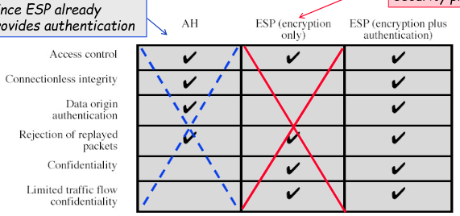
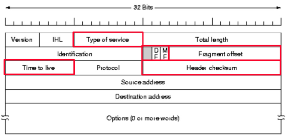
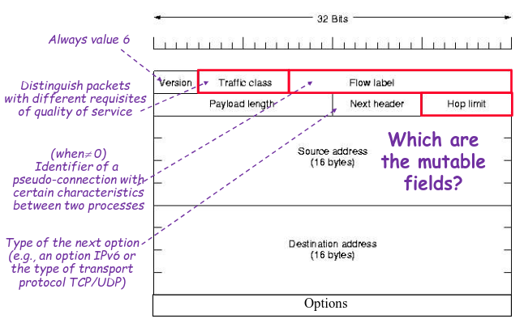
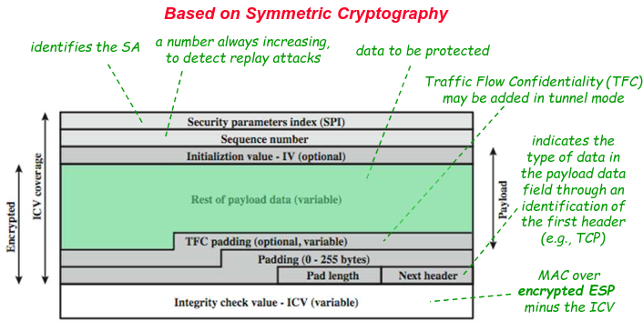
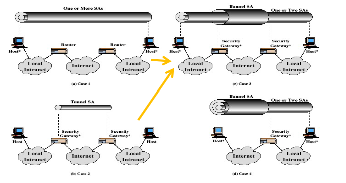

# IP Security

As we know, when a packet passes through the internet it has to pass through 5 layers.

Layers
- Application
- Transport
- Network
- Data
- Physical

Security can be implemented in any of these layers

We will be focusing on IP which is part of the network layer and how security is implemented at its level.

Throughout they years many attacks were made that exploited the IP layer, like IP sniffing and spoofing.

In many situations it was required to create aditional secure channels to protect the traffic when application level security hasn't enough.

To this effect IPSec provide secure communication in LAN between 2 machines at a IP level.

# IPSec

The main advantages of IPSec in comparison to other methodologies
- Internal traffic isn't affected given IPSec will only be used at the door of firewalls/routers
- Tranaparency to the user, given there is no need to update application or transport code
- Transparent to application, given IP level changes wont affect application level

There were 3 services provided by IPSec, but 2 already were deprecated:
- AH (Authentication Header) which has been deprecated
- ESP (Encapsulating Security Payload Header) with encryption only which has been deprecated
- ESP (Encapsulating Security Payload Header) with encryption and authentication

Each of the service provided different features

All these services could be used in either
- Transport mode - which protected data from protocols above IP (usual for users)
- Tunnel mode - which protected the entire IP packet (usual for firewalls)

## Security Policy

Security policy is a protocol applied to each packet transmitted from a source to a destination

It is based on 2 databases
- Secure policy database (SPD)
- Secure association database (SAD)

A secure association is a one-way relationship between the sender and a receiver.
It is defined by the destination IP, the security parameter index and the security protocol identifier.

This being said in the SAD, for a certain identifier we store features such as
- Counter values
- encryption/decryption algorithms
- SA lifetime
- protocol mode (tunnel or transport)

Given a certain packet received in a host we need to determine which SA should be used for that specific packet, this information is store in the SPD

The SPD is defined to give for each specific type of IP traffic certain features
- Destination IP address
- Source IP address
- Transport protocol
- source and destination ports

# IPSec OPs

IPV4 Packet

IPV6 Packet

ESP Packet

## Detection of replay attacks

Given that IP doesn't ensure orderly deliver of packets the only way to defend against replay attacks is by keeping a counter in the packets.

We can then know if a counter is received more than once a replay happened.

## ESP protection

Many encryption algorithms can be used in ESP, like AES.

There is usually the need to also use IV's and moreover to only make authentication after encryption.

MISSING TUNNEL MODE

## Authentication Header Protection

Given the predictable nature of IP headers, because they don't change while in transit.

We can use hashes to verify the authentication of the data.

It is common to use HMAC for this purpose

## Adding SA

Secure association bundle is a way of adding SA to IPSec, it is done by adding multiple SA to reference different types of traffic in the network.

There are 2 main ways of adding SA
- Transport adjacency - Apply more than 1 SA using tunnels
- Iterated tunneling - Apply more than 1 tunnel with different characteristics

## Key Management

This involves the distrubution and management of keys in IP

Each pair of nodes requires 4 keys to communicate

There are 2 types of key distribution
- Manual - Done by a sysadmin
- Automatic - Done by automatic systems

Normally key distribution software don't use protocols like diffie hellman given they have multiple problems

### IKE

This being said they use IKE(Internet Key Exchange) protocols

These have some advantages compared to DH
- Use cookies to defend against DOS
- Allow for negotiation of global parameters
- Support exchange of DH public parameters
- Use nonces to defend against replay
- Authenticate to defend against MITM

IKE protocol uses pairs of messages, in what is called an exchange

The protocol goes as follows
1. First Exchange
   - IKE_SA_INIT - negotiates parameters for IKA SA, sends nonces and DH values
   - IKE_AUTH - Sends identifiers and certificates, proves knowledge of secrets and sets up AH or ESP
2. Second Exchange
   - CREATE_CHILD_SA - Sets up child SA
   - INFORMATIONAL - Delete SA and reports conditions

CHECK MORE ABOUT IKE --TODO