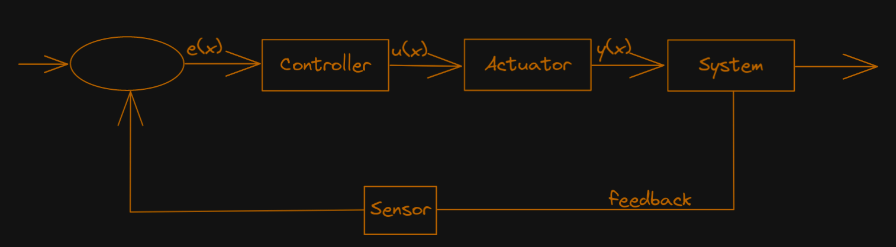
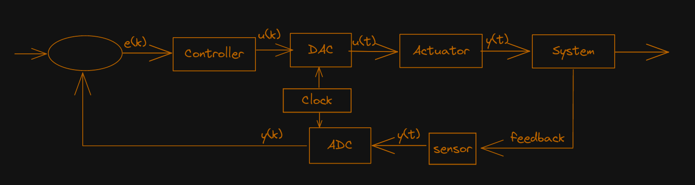
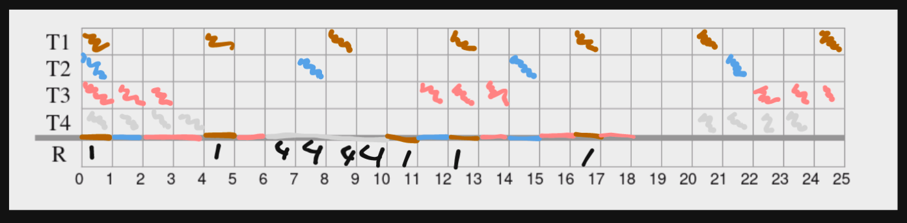

# Exam1617


# Remember what you learned about closed-loop control systems.

## Using a block diagram, explain the basic architecture of a general closed-loop control system, highlighting the functionality of each block. (1 val)





## Give an example of a practical closed-loop control system, explaining its purpose and what each general block corresponds to in the example. (1 val)

Take for example the driving system in a car, the closed loop system can be used to control the direction the car wants to go, in comparison to the direction the car is going.

In this situation
- the controller would take as input the deviation, between the real direction and the expected direction, and output the commands to the actuators. These commands would be made with the intent of minimizing the error.
- The actuators would act over the system based on the inputs they received, and therefore nudge the car in a different direction
- The system, which would be the car, would start moving in a different trajectory based on the action of the actuators
- The sensor would receive new feedback from the new system state and pass it on to be combined it with the expected direction in order to get a new error value 
- The error value would be used as input for the controller, restarting the cycle.

## Again using a block diagram, show the general closed-loop control system considering that the controller is implemented in a digital system, explaining the interface between the digital controller and the physical world, and the types of signals involved. (1,5 val)



The main difference in this system to question 1 is the presence of the ADC (Analog Digital Converter) and the DAC (Digital Analog Converter).

These are used to convert signals from a digital form which is understood by computers to an analog form which is understood by sensors and actuators.

In the ADC the interface steps are:
- Receive Analog
- Sample Analog to create Sample Data
- Hold Sample Data to create quantized
- Quantize and encode to create Digital

In the DAC the interface steps are:
- Receive Digital
- Decode Digital to create Sample Data
- Hold Sample Data to create Quantized
- Filter Quantized to create Analog

To this effect when we transfer signals between these 2 we have to use intermediate systems in the order
- DAC - Digital -> Sample Data -> Quantized -> Analog
- ADC - Analog -> Sample Data -> Quantized -> Digital

# In the context of cyber-physical systems there are new challenges to be addressed in the design of control systems. Give a brief explanation of three of such challenges. (1,5 val)

This is for WSN because i can't find this in the slides

Heterogeneity, in a WSN we have multiple types of devices which need to be controlled it is common for these devices to be different from one another and to this effect we must take this fact into consideration when building our systems.

Distributed Calculations, centralized calculation is more often than not more expensive not only for a single node, bu also for the entire network given the costs of transporting the required information. To this effect we should design our network in a way that it allows for distribution processing where each node can process some part of the information generated.

Real time Computation, given the system is permanently generating data it is crucial our computations are made in real time in a way that it doesn't create a backlog of information to be processed.

# Assume that the difference equation of a digital controller in a closed-loop control system, is: 
$$𝑢[𝑘 + 1] = 𝑢[𝑘] + (𝑇𝐾𝑖 − 𝐾𝑝)𝑒[𝑘] + 𝐾𝑝𝑒[𝑘 + 1].$$ 
## Using simple expressions and pseudo-code, give an example of how a computer program could be written to implement the digital controller. (1,5 val)

```
const Ki
const Kp
const Kpe

list previousInputs = []
list previousError = []
Sensor sensor
Actuator actuator

main loop():

    time = 0
    while True:
        prevError = previousError[time-1]
        prevInput = previousInput[time-1]
        currentError = sensor.getError

        newAct = prevInput + ((time * Ki) - Kp)*prevError + Kp * currentError

        actuator.act(newAct)
        time++


```


# In Cyber-Physical Systems the interactions with the environment often imply the need to characterize the distribution of event arrival, besides modelling the physical processes themselves

## Explain why it may be important to precisely characterize event arrival distributions, describing the main distributions that are usually considered. (1 val)

Event arrival distributions can be one of 3 types:
- Aperiodic - No bounds regarding event arrival time
- Periodic - Events arrive at periodic time intervals
- Sporadic - Events arrive in sporadic time intervals but with a lower bound

Each of these is characterized by having different distribution for event arrival time. And depending on the distribution our system will can have different requirements and different advantages.

Depending on the time of system we can have different assurances regarding maximum and minimum event load, and can also have assurances regarding maximum information throughput required.

Moreover we can classify event arrival into bursts which are defined based on 2 metrics, and which also serve a similar purpose.

Event arrival distribution is defined by 2 values:
- Burst Period - Minium time between bursts
- Burst length - Maximum amount of information in a burst


## Which of those models can be considered in Time-Triggered systems? Justify your response. (1 val)

In a time-triggered approach events are processed based on a clock time and in every clock time only x amount of events can be processed.

This approach can be considered as periodic given that, similarly to periodic distribution, our events will "arrive" in periodic time intervals. Given that they are only processed periodically.

# Consider a control system to control the gate of a train passage. One of the system specifications is the following:

event train_arriving generates event close_gate

## Using this example, explain the meaning of response time and why it is important to characterize the minimum and the maximum response time. (1,5 val)

Response time is a value of an related to an event which is defined as the time between the occurrence of the input event and the occurrence first output event.

This value is directly correlated to 2 other values:
- Maximum response time - Maximum time between the input event and the first output event, normally used to give assurances of reliability and timeliness of the system
- Minimum response time - Minimum time between the input event and the firs output event, normally used for analysis of variance response.

In the given example, the response time would be the time it takes for the system to process the train_arriving event and to trigger the close_gate event.

The importance of these 2 factors is for example:
- If the maximum response time is to big, the gate might close way after the train already arrived, if this is in an intersection between a road and a train track this could lead to cars crashing into the train because the gate wasn't closed on time
- If the minimum response time is too small, we would need to more accurately predict the place at which the train is, we could be closing the gate way earlier than it would be required because we thought the system would take longer to process the response.

With these 2 values we would be able to predict the exact position at which the sensor should be in order for security of the train and for efficiency of the gate.

## Explain in detail how the round-trip clock synchronization technique works and how the (master) clock reading error is calculated, as a function of the round-trip time (Trd) and the minimum transmission delay (TDmin). (1,5 val)

Round-trip clock syncrhonization is a type of external synchronization and therefore uses an external global absolute clock to synchronize a system clock.???? not in slides


# Consider an application with four periodic tasks, with the following characteristics:

| Task  | Period    | Computation   |
|-      |-          |-              |
| T1    | 4         | 1             |
| T2    | 7         | 1             |
| T3    | 11        | 3             |
| T4    | 19        | 4             |


## Verify the schedulability of the task set based on a response time analysis (assume RM scheduling with period=deadline). (1,5 val)

Using Rate Monotonic we know the priority is inversely proportional to the period, and therefore the priorities are: T1 -> T2 -> T3 -> T4

Utilization:

T1 = $\frac{1}{4}$ = 0.25

T2 = $\frac{1}{7}$ = 0.14

T3 = $\frac{3}{11}$ = 0.27

T4 = $\frac{4}{19}$ = 0.21

Utilization factor = 0.87

Task 1

$R^0_1 = 1$

Task 2

$R^0_2 = 1$

$R^1_2 = 1 + \frac{1}{4}*1 = 2$

$R^2_2 = 1 + \frac{2}{4}*1 = 2$

...

$R^6_2 = 1 + \frac{2}{4}*1 = 2$

Task 3

$R^0_3 = 3$

$R^1_3 = 3 + \frac{3}{4}*1 + \frac{3}{7}*1 = 3 + 0.75 + 0.4 = 5$

$R^2_3 = 3 + \frac{5}{4}*1 + \frac{5}{7}*1 = 3 + 1.25 + 0.7 = 5$

$R^3_3 = 3 + \frac{5}{4}*1 + \frac{5}{7}*1 = 3 + 1.25 + 0.7 = 5$

Task 4

$R^0_4 = 4$

$R^1_4 = 4 + \frac{4}{4}*1 + \frac{4}{7}*1 + \frac{4}{11}*1= 4 + 1 + 0.6 + 0.4 = 6$

$R^2_4 = 4 + \frac{6}{4}*1 + \frac{6}{7}*1 + \frac{6}{11}*1= 4 + 1.5 + 0.9 + 0.6 = 7$

$R^3_4 = 4 + \frac{7}{4}*1 + \frac{7}{7}*1 + \frac{7}{11}*1= 4 + 1.9 + 1 + 0.6 = 8$

$R^3_4 = 4 + \frac{8}{4}*1 + \frac{8}{7}*1 + \frac{8}{11}*1= 4 + 2 + 1.2 + 0.8 = 8$

Given no deadlines were surpassed we can conclude the tasks are schedulable.

## Consider that tasks T1 and T4 need to use (in mutual exclusion) a shared resource R during their execution. Consider that the resource is not managed by any priority inheritance protocol. Both tasks need the resource during its entire execution. Still using RM, draw the corresponding execution trace in the interval [0, 25]. (1 val)


## Considering now that resource R is managed by the Original Ceiling Priority Protocol (OCPP), draw again the execution trace in the interval [0, 25]. (0,5 val)



## Is it possible to conclude about the schedulability of the task set in the two situations considered in the previous questions (7b and 7c)? If yes, indicate what can be concluded. If no, then explain why not.

In both situations the tasks were schedulable, given there was enough timeslots for all tasks to execute without any deadlines being missed.

To this effect the problem with the 2 previous situations stemmed from the fact that there was a priority inversion in task 4 by task 2 which stopped task 1 executing.

# Consider a CAN bus connecting three stations (nodes) A, B, and C

- Node A produces a CAN object with identity 1A5.
- Node B produces two CAN objects with identity 100 and with identity 1A3

## Which of the three messages has the highest priority? Why? (0,5 val)

CAN gives higher priority to objects with lower IDS, beacuse they have more 0's at the left and 0 is the dominant bit in a CAN system.

So we just need to translate messages to binary

A -  000110110101

B1 - 000100000000

B2 - 000110110100

To this effect we can conclude that the message with highest priority is B1 or 100

## Knowing that node C is a controller, explain how can node C request object with identity 1A3 to be produced, and what happens if the object is being produced exactly at the same time node C requests its production (0,5 val)

In order for C to request an object it has to send a request frame for said object.

In order:
- C prepares the frame used to request 1A3
- C sends the request to the BUS
- If no conflicts occur with the CAN system the message is sent
- If conflicts occur then C is put in receiver node and tries to resend after
- Node P which has 1A3 sends the frame with the data
- C listens to the data
- The same conflict assurance is used in this situation

## Explain why the bit stuffing mechanism is necessary in the CAN network and how it is implemented. (1 val)

Bit stuffing is a mechanism present in CAN which consists of every n number of consecutive bits with the same value (usually 5), a bit of the opposite value is sent.

This mechanism is used in CAN for 2 purposes:
- Synchronization between nodes, in order to prevent confusions with flags and fields in the frame
- Error checking, in order to ensure the message sent is being correctly formatted

To this effect when the stuffed bit is received in the other side it is discarded by the receiver given it isn't part of the original message.

