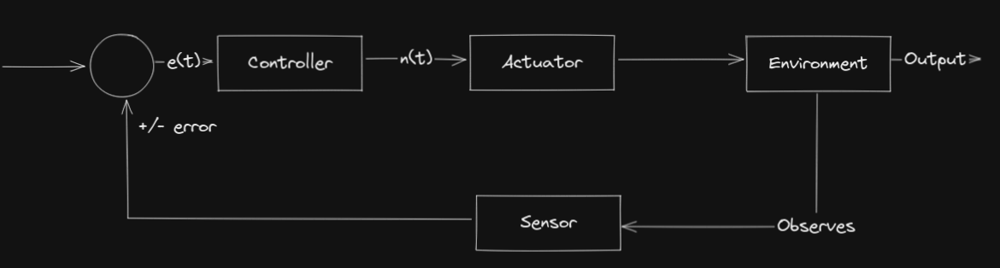
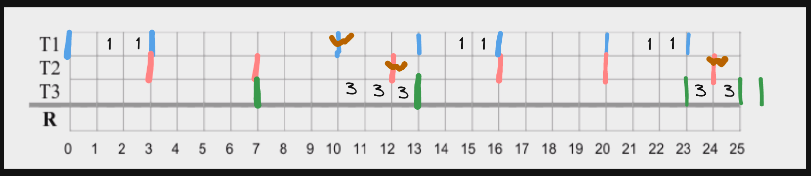

# Exam 18/19 Cyber Physical Systems

## Part 1

1 - In distributed real-time systems, the notion of jitter characterizes:

A

2 - The accuracy of local clocks, synchronized by means of external clock synchronization

D

3 - The RM scheduling algorithm

C

4 - A necessary schedulability test

B

5 - Remember what you learned about system characteristics and model representations. Circle the correct statement

C

6 - Remember what you learned about digital control systems and the types of signals involved. Circle the correct statement:

B?

7 - What are the main structures of a program for the Arduino

A

8 - Considering the real-time Linux operating system used in the project course, which of the following sentences is TRUE

D, ADEOS

9 - In a CAN bus with 3 stations, an error signalling sequence (excluding delimiters) can use at most:

???

10 - In TTP/C, each FTU slot in the TDMA cycle:

??? slot?

## Part 2

**Consider that you must implement a real-time distributed system in which nodes communicate using
a switched Ethernet network. Every node is directly connected to the switch with a full-duplex
connection. Discuss the conditions under which it would be possible to achieve real-time
communication. (1 point)**

The system in order to be realtime would need timeliness that would be to respect deadlines.

We would first need every node to possess a clock, a realtime operating system and one of the nodes (probably the switch) would need to have a scheduler.

To this effect in order to achieve real-time we would need each node to try to complete a certain task by communicating with the switch.

For the switch to know which task is supposed to be in execution at a certain time it would require the usage of the scheduler to schedule each task in a specific time frame.

This would also provide the scheduler and the tasks with a specific deadline they should follow.

In order for the nodes to know the deadline of their tasks and when they should try to do them, they would need clocks. Moreover they would need to synchronize their clocks with the "master" clock which would be the switch.

This would also impart in the system another feature of RL which would be to agree based on time synchronization.

**What is the precise meaning of priority inversion in real-time systems? Explain why it is possible
that priority inversion becomes a problem and describe carefully the solutions that may be used to
minimize this problem. (1,5 points)**

Priority inversion is a problem characteristic to real-time systems, the origin of this problem derives from a situation where we have 3 tasks one of high priority, one of medium priority and one of low priority, moreover we have a scheduling protocol which is preemptive.

During the course of the problem, we have the low priority task obtain the mutex of a resource, this low priority task is then preempted by a medium priority task which is then preempted by a high priority task.

This high priority task will then try to get the mutex of the resource, which is  now locked by the low priority task.

This will make the high priority task hang until the low priority task completes, which will be never considering it was preempted by the medium and high priority task.

A way to solve this problem/minimize is the utilization of methods like priority hierarchy/elevation (me don't remember), this is a algorithm in which when this situation happens and a high priority task is waiting for a resource which is being held by a lower priority task, this low priority task is elevated to the high priority tasks priority level so it can complete.

**Event-triggered systems are potentially subject to what is called “event showers”. Describe this
problem and explain why it cannot be observed in time-triggered systems. (1 point)**

Event showers are a problem subject to Event-triggered systems, which derives from a situation where the system is overwhelmed by command events and as such cant respond to them all in the time frame

This situation can't happen in time-triggered systems, given only a single command can be in a time frame. This on one side means the system wont be overwhelmed, given the time frames are chosen as to make the system able to handle the load, but also means the system is forced to work at a certain time rate.

**Remember what you learned about closed-loop digital control systems.**

**1. Using a block diagram, explain the basic architecture of a general closed-loop digital control
system, highlighting the functionality of each block. (0.6 val)**

Explain the basic functionality of the interfaces between the digital controller and the physical
world, and the types of signals involved. (0.9 val)

**2. Explain the basic functionality of the interfaces between the digital controller and the physical
world, and the types of signals involved. (0.9 val)**

Given that computers work with digital signals and sensors and actuators work with analog signals it is paramount that we add a intermidiate layer between these 2 components whose purpose will be to interface between them.

To this effect we have ADC (Analog to Digital Converter) and DAC (Digital to Analog Converter).

The purpose of these 2 will be to as indicated aboce make conversions between system types

These conversions will take 4 types of systems
- Digital
- Quantized
- Sample-Data
- Analog

And it will follow the order
- DAC - Digital -> Sample-Data -> Quantized -> Analog
- ADC - Analog -> Sample-Data -> Quantized -> Digital

**Remember the Proportional, Integral and Derivative (PID) controller.**

**Explain how each of the terms employed in a PID controller use the input error signal,
highlighting the inherent principle associated to each term. (0.8 val)**

The pid controller follows the formula

$$u(t) = K_pe(t) + K_i\int_0^te(t) + K_d\frac{de(t)}{dt}$$

Each of these terms presents part of the 3 parts of the PID

P = $K_pe(t)$

I = $K_i\int_0^te(t)$

D = $K_d\frac{de(t)}{dt}$

These terms will represent

P = the current/actual error

I = the past/accumulated error

D = the future/predicted error

**Describe the main goals to achieve when tuning the constants (K p , K i , K d ) of a PID
controller. (0.7 val)**

The goal will be to find values for $K_p , K_i , K_d$ such that the values of the controller are adequate.

To this effect we must take into consideration that

- $K_p$ - Measures the way the controller reacts to instantaneous error, and as such high values will lead to larger changes in the output.
- $K_i$ - Measures the way the controller reacts to error overtime, and as such high values will lead to more aggressive changes to persistent errors.
- $K_d$ - Measures the way the controller reacts to the change rate of error, and as such high values will lead to more corrective action when the error is changing rapidly, which can lead to some overshoot.

A good method to tune these values is:
- Set them all to 0
- Change the value of $K_p$ until the value is accurate, but has problems maintaining the value
- Change the other values such that we limit overshoot and minimize aggressive correction.

**Consider the following alternatives to connect a microcontroller to a peripherical: I2C (Inter
Integrated Circuit) and SPI (Serial Peripheral Interface Bus). What are the main differences between
these two alternatives? (1,5 points)**

The main differences will be the speed of the controller in Hz, the number of wires in the BUS and the way slaves can share the BUS.

# Part 3

**Consider three processes P, Q and S. P has a period of 100 ms in which it requires 30 ms of
processing. The corresponding values for Q and S are (5,1) and (25,5) respectively. Assume that P
is the most important process in the system, followed by S and then Q**

**What is the overall processor utilization?**

The overall processor utilization will be

$$U_i = \sum_i^{tasks}\frac{c_i}{T_i}$$

With $T_i$ being the base period which will be calculated with $mmc(5,25,100) = 100$

Therefore will be

$$U_i = \frac{30ms}{100ms} + \frac{1ms}{5ms} + \frac{5ms}{25ms} = \frac{70ms}{100ms} = 0.7$$

**What would be the behavior of the scheduler if priority assignment was based on importance?
Would the task set be schedulable?**

Schedulability is given by the formula

$$C_i + \sum_j[\frac{D_i}{P_j}]C_j \leq D_i$$

We need only to calculate for 100ms

For task P

$$R_0^P = 30$$

For task Q

$$R_0^Q = 1$$

$$R_1^Q = 1 + \sum_j[\frac{100}{5}]C_j \leq D_i = 1 + 20*30 \leq 5$$

As we can see task Q isn't already schedulable so task set isn't schedulable.

**How should the processes be scheduled so that all deadlines are met? (0,5 points)**

Tasks should be order inversely such that Q > S > P

this beacuse

For task Q

$$R_1^Q = 1$$

For task S

$$R_1^S = 5$$

$$R_2^S = 5 + \sum_j[\frac{5}{5}]1 = 6 $$

$$R_3^S = 5 + \sum_j[\frac{6}{5}]1 = 6 $$

$$R_4^S = 5 + \sum_j[\frac{6}{5}]1 = 6 $$

For task P

$$R_1^S = 30$$

$$R_2^S = 30 + \sum_j [\frac{30}{5}]1 + [\frac{30}{25}]5 = 37$$

$$R_3^S = 30 + \sum_j [\frac{37}{5}]1 + [\frac{37}{25}]5 = 40 $$

As we can see it is schedulable

**Consider an application with three periodic tasks, with the following characteristics**

**Considering that a fixed priority preemptive scheduler is used, and that no priority inheritance
protocol is used to manage resource R, draw the execution diagram for the task set in the interval
[0,25]. In the resource row, write the number of the task that holds resource R at each time slot.
(1,5 points)**

Given the priority inversion problem we can see, task T3 will hang on to the mutex of R and hold task T1 from executing.

**Considering the previous trace, what is the maximum blocking time experienced by task T1, the
maximum interference time observed for task T3 and the maximum response time measured for
task T2? (0,5 points)**

The maximum blocking time experienced by T1 is 10ms

The maximum interference time experienced by T3 is 13

The maximum response time will be ???

**Consider now that resource R is managed by the IPCP protocol. Redraw the execution diagram
for the task set in the interval [0,25]. In the resource row, write the number of the task that holds
resource R at each time slot. (1 point)**

