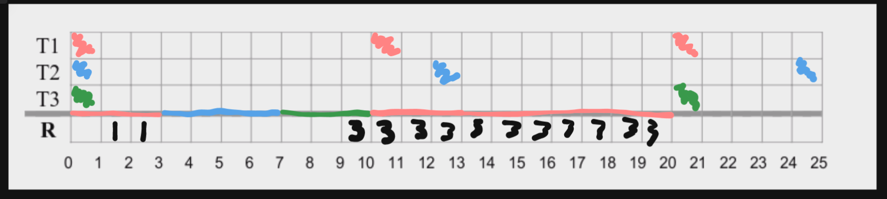

# Multiple Choice

In distributed real-time systems, the notion of jitter characterizes: A

The accuracy of local clocks, synchronized by means of external clock synchronization: D ??

The RM scheduling algorithm: D

A necessary schedulability test: C

Remember what you learned about system characteristics and model representations: C

Remember what you learned about digital control systems and the types of signals involved: B

What are the main structures of a program for the Arduino? A

Considering the real-time Linux operating system used in the project course: C X

In a CAN bus with 3 stations, an error signalling sequence (excluding delimiters) can use at most:

In TTP/C, each FTU slot in the TDMA cycle:

# Consider that you must implement a real-time distributed system in which nodes communicate using a switched Ethernet network. Every node is directly connected to the switch with a full-duplex connection. Discuss the conditions under which it would be possible to achieve real-time communication.

A real-time system is defined as a system which has requirements from the environment based on timeliness.

To this effect, the conditions where it would be possible to achieve real-time communication would be in machines which have a perception of timeliness.

Given we are using a ethernet switch we can assume timing protocols are already implemented.

Therefore we must only establish the requirements for the system, lets say the requirement in question is a deadline for the connection with the switch.

We would need every machine to establish a deadline with the switch and then try to operate in a timely manner in order to not violate the deadline.

To this effect a scheduler could be advantageous given we don't know how many connections the switch can have open at a certain time.

# What is the precise meaning of priority inversion in real-time systems? Explain why it is possible that priority inversion becomes a problem and describe carefully the solutions that may be used to minimize this problem. (1,5 points)

Priority inversion is a problem characteristic to RT systems, in this problem we have normally the following course of events:
- Low priority task uses resource R1 and locks it
- Low priority task is preempted by medium priority task
- Medium priority task is preempted by high priority task
- High priority task tries to use resource R1
- High priority task hangs because low priority task didn't release lock in R1

In this situation, the high priority task usually hangs until a deadline is exceeded and to this effect normally can't proceed which might have all sorts of effects on the system.

There are 2 main algorithms to protect against this attack type. 
- Original Ceiling Priority Protocol
- Immediate Ceiling Priority Protocol

These 2 protocol work similarly with one difference, both:
- Define a static priority for the tasks
- Define a static ceiling priority for the resource, which is the max between its own priority and the priority of all tasks which use it

But differ in defining each tasks dynamic priority:
- In OCCP - The dynamic task priority is defined has the maximum between its own priority and the priority of all tasks it is blocking
- In ICCP - The dynamic task priority is defined has the maximum between its own priority and the ceiling priority of the resource its using

Both these algorithms are able to solve this problem and both are examples of priority inheritance protocols.

# Event-triggered systems are potentially subject to what is called “event showers”. Describe this problem and explain why it cannot be observed in time-triggered systems. (1 point)

Event showers are a type of problem in which the system is flooded by multiple events simultaneously, which normally leads to the system having problems processing them all in time.

To this effect, the reason time-triggered system don't suffer from this problem is because they process events based on a clock, this leads to the system having a fixed throughput and therefore not being able to be flooded by events.

# Remember what you learned about closed-loop digital control systems.

## Using a block diagram, explain the basic architecture of a general closed-loop digital control system, highlighting the functionality of each block.

## Explain the basic functionality of the interfaces between the digital controller and the physical world, and the types of signals involved.

The interfaces between the digital controller and the physical world serve convert signals from a digital form, which the computer understands, to an analog form which the sensors and actuators understand.

The conversions are usually made using 2 devices for the interfaces:
- DAC - Digital Analog Controller, put between controller and actuator
- ADC - Analog Digital Controller, put between sensor and controller

The conversion of signals is done

In the ADC:
- Sample analog signal to get sample data signal
- Hold sample data signal to get quantized signal
- Quantize and encode quantized signal to get digital signal

In the DAC:
- Decode digital signal to get sample data signal
- Hold sample data signal to get quantized signal
- Filter quantized signal to get analog signal

To this effect we are only doing conversions in both these situations, the conversions require some intermediate signals specifically:
- ADC - Analog -> Sample -> Quantized -> Digital
- DAC - Digital -> Sample -> Quantized -> Analog

# Remember the Proportional, Integral and Derivative (PID) controller.

## Explain how each of the terms employed in a PID controller use the input error signal, highlighting the inherent principle associated to each term. (0.8 val)

Each of the terms of the PID controller is named after the mathematical operation it uses over the input error value:
- P - Proportional
- I - Integral
- D - Derivative

All to be combined into the formula

$$u(t+1) = K_p * e(t) + K_i \int_0^t e(t) + K_d * \frac{de(t)}{dt}$$

Each of these terms has an inherent principle associated with it:
- Proportional - present error
- Integral - past error
- Derivative - future error

To this effect each of the terms has different consequences over the input value when compared with the expected result
- Proportional - More overshoot, faster reaction speed, steady state != 0
- Integral - Less overshoot, slower reaction speed, steady state == 0
- Derivative - Less overshoot, faster reaction speed, steady state != 0

## Describe the main goals to achieve when tuning the constants (K p , K i , K d ) of a PID controller.

The goal when tunning the constants $K_p , K_i , K_d$ is to:
- Minimize overshoot
- Get a fast reaction speed
- Have steady state equal to 0

To this effect, there is an technique to try to pin point the best value:
- Start with all values at 0
- Change P until the value oscillates steadily
- Change the other values...

# Consider three processes P, Q and S. P has a period of 100 ms in which it requires 30 ms of processing. The corresponding values for Q and S are (5,1) and (25,5) respectively. Assume that P is the most important process in the system, followed by S and then Q.

## What is the overall processor utilization?

| Task  | Period    | Cost  |
|-      |-          |-      |
| P     |100        |30     |
| Q     |5          |1      |
| S     |25         |5      |

The overall processor utilization is calculated with:
$$U_i = \sum_0^n \frac{c_i}{T_i}$$

So we now the value is:
$$U = \frac{30}{100} + \frac{1}{5} + \frac{5}{25} = 0.3 + 0.5 + 0.2 = 0.7$$

## What would be the behavior of the scheduler if priority assignment was based on importance? Would the task set be schedulable? Justify.

The priority is:
P -> S -> Q

The task set would not be schedulable given we can clearly see that task P would be executed first given it has the highest priority.

And therefore both task Q and S would miss their deadlines in the first 30 seconds while P is executed.

## How should the processes be scheduled so that all deadlines are met? 

Using an protocol like RM.

We can conclude with response time analysis that all tasks would be schedulable.

Lets say the order is Q -> S -> P

mmc(5,25,100) = 100

Task Q

$R^Q_0 = 1$

Task S

$R^S_0 = 5$

$R^S_1 = 5 + \frac{5}{5} * 1 = 6$

$R^S_2 = 5 + \frac{6}{5} * 1 = 7$

$R^S_3 = 7 + \frac{7}{5} * 1 = 7$

Task P

$R^P_0 = 30$

$R^P_1 = 30 + \frac{30}{5} * 1 + \frac{30}{25} * 5 =  30 + 6 + 6 = 42$

$R^P_2 = 30 + \frac{42}{5} * 1 + \frac{42}{25} * 5 =  30 + 8.4 + 8.4 = 47$

$R^P_2 = 30 + \frac{47}{5} * 1 + \frac{47}{25} * 5 =  30 + 9.4 + 9.4 = 50$

As we can see no deadlines were surpassed

# Consider an application with three periodic tasks, with the following characteristics:

## Considering that a fixed priority preemptive scheduler is used, and that no priority inheritance protocol is used to manage resource R, draw the execution diagram for the task set in the interval [0,25]. In the resource row, write the number of the task that holds resource R at each time slot. (1,5 points)

## Considering the previous trace, what is the maximum blocking time experienced by task T1, the maximum interference time observed for task T3 and the maximum response time measured for task T2? (0,5 points)

Blocking time T1 - 10

Maximum interference time T3 - 27

Maximum response time T2 - 7

