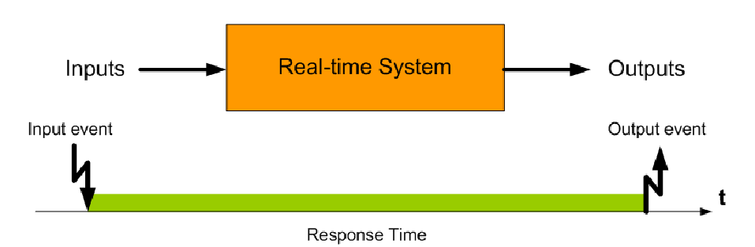
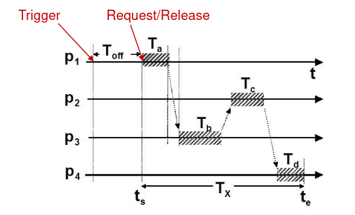
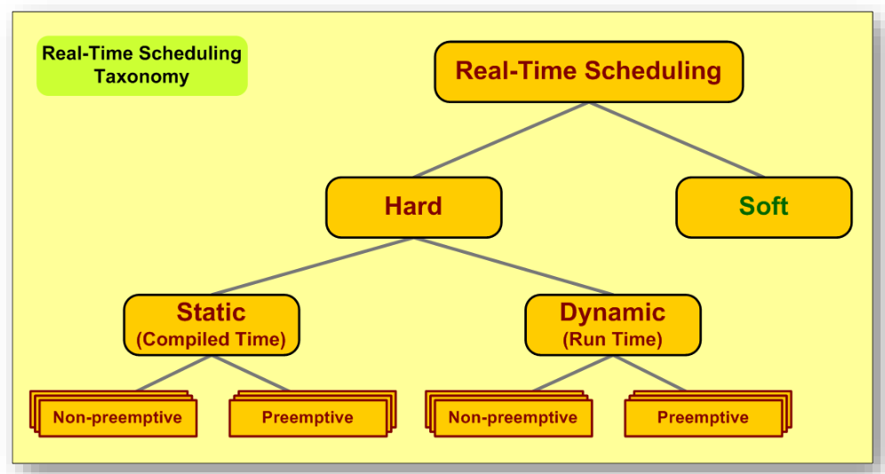
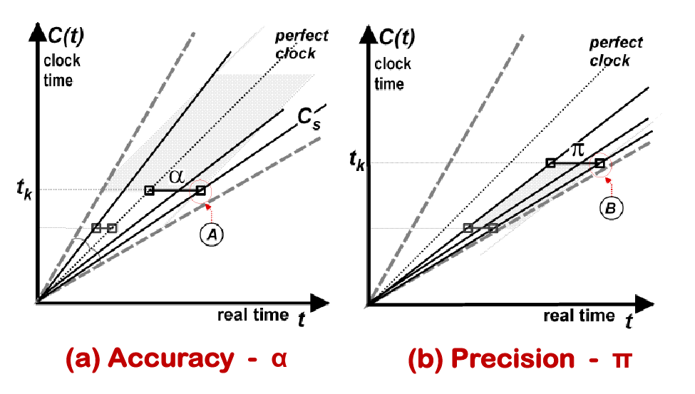

# Temporal Specifications

Temporal specifications arise from the need to specify, quantify and describe the timing of events within the context of real-time communication and computation

## Response Time

Response time defines the interval between the occurance of an input and the occurance of the first event related to the output

Related to this both:
- Maximum Response Time
- Minimum Response Time

## Timed Action

A timed action is defined asthe execution of an operation such that the end of the operation takes place within a certain interval $T_a$ which is defined based on a real instant $t_a$

In this situation
- Termination time(Tx) - Value from beggining to end of execution of operation
- Deferral Time ($T_{off}$) - Delay inputed before the execution of the operation
- Execution Time (T_{Et}) - Total duration of the operation, equivalent to $T_a$ + $T_b$ + $T_c$ + $T_d$

## Timing of events

Timing Errors (jitter) - Defined as the uncertantny associated with the instant of completion of a certain operation

2 approaches can be implemted to define timings
- Event Triggered - System reacts upon occurance of input event
- Time Triggered - System reacts upon the command of a clock

## Event arrival Characterization

Real time system react to events therefore we need to try to categorize, we do it regarding 2 metrics
- Amount of events
- Regularity

One metric all events share is Utilization Factor, which defines the percentage of useful work time of a resource.

To this effect 3 types of events are defined
- Aperiodic - No bounds regarding amount or interval between events, no guarantees of determinism
- Periodic - Events occur regularly with a know amount and interval, providing determinist behavior. 
- Sporadic - Events occur irregularly, but we can define some bounds like inter-arrival time

# Scheduling

Scheduling defines how a certain resource will be shared across different tasks given a certain policy.

The goal will be that all tasks can meet their deadlines.
To this effect we need to allocate time so all timing requirements are met.

This leads us to Real Time Scheduling, which is separated into parts:

## Taxonomy

Firstly we have:
- Static - 
  1. Performed off-line, and is based on the search for suffecient schedulability.
  2. Requires Periodic/Sporadic Tasks
- Dynamic - Has multiple algorithms among which are
  1. Rate Monotonic - Priority inversly porpotional to period
  2. DeadLine Monotonic - Priority inversely porportional to deadline
  3. Earliest Deadline First - Priority inversely porportional to deadline
  4. First come First Served

By priority we define the urgency of a task, this factor is usualy used by schedulers to define which tasks need to be executed first.

Priorities can be pre-defined (static) or ajusted at runtime (dynamic).

Secondly we have:
- Non-preemption - A task cannot be interrupted until it finishes completion, or releases resource
- Preemption - A task can be interrupted by another task with higher priority

Lastly we have:
- Centralized - Scheduling is done by a single entity
- Distributed - Scheduling decisions are taken by different nodes in the network

## Schedulability

Schedulability is the means by which we try to detect the existance of a shcedule for a certain problem.

To this effect 3 main areas are defined
- Schedulability testing - Used to determine the existance of a schedule
- Feasible schedule - Schedule can be done with avalable resources
- Optimal Scheduler - Scheduler that finds a schedule if such is feasable.

There exist 3 types of Schedulability test
- Sufficient - Passing it indicates task in schedulable, the oposite indicates nothing
- Necessary - Failiing it indicates a task isnt schedulable, the oposite indicates nothing
- Exact- Passing it indicates task in schedulable and failiing it indicates a task isnt schedulable

For each type of task we will have different types of scheduling to consider.
But for all we have
- $c_i$ - worst case execution time
- d - deadline
- $r_i$ - release time
- $\phi_i$ - first release time

And depending on the type of task we have
- Periodic - $T_i$ period
- Aperiodic - $a_i$ interval between activations
- Sporadic - $m_i$ minimum inter-arrival time

This factors can be used to calculate Utilization factor for each type of task
- Periodic - $\frac{c_i}{T_i}$ 
- Aperiodic - $\frac{c_i}{a_i}$ 
- Sporadic - $\frac{c_i}{m_i}$ 

# Algorithms

## Rate Monotonic Scheduling

RM is a type of static scheduling given that priorities are defined based on the period of the tasks, and as such these values dont change in runtime

The lower the period the higher the priority

Is a preemptive method.

## Earliest Deadline First Scheduling

Dynamic scheduling given that it depends on the deadlines of tasks which switch as tasks complete their deadlines and time passes.

Task are ordered inversely porpotionally to their deadline, higher priority given to tasks with lower deadlines.

Aplicable to periodic and non-periodic tasks

Assumes independence between tasks.

# Priority Inversion

Priority inversion is a problem related with scheduling protocols in which the scheduling allows a certain task to block or delay the execution of a task with higher priority.

This is usually done beacuse a task with low priority, after obtaining a resource, was preempted by a medium priority task which in itself was preempted by a higher priority task.

This higher pririty task will try to use the resource obtained by the lower prioirty task and infinitly wait for a task which will never end given it was preempted.

Basically a loop of task which await for each other.

A possible solution is the usage of Priority Inheritance, in which the low priority task which is locking the resource is elevated to the priority of the high priority task, in order to finish and release the resource allowing the high priority task to complete execution.

# Timing Failure Detection

A timing failure is defined when a action that needed to terminte until a certain moment in time, exceeds that moment.

The amount of delay of a certain action is called lateness degree is defined by $L_d = t_e' - t_e$

Detection failure should be
- timely - detecting failure in bounded time
- complete - detecting all time failure actions
- accurate - not detection non failures as failures

# Entities and Representatives

The relationship between the elements in the real world environment and their computational counterparts is essential to CPS's

To this effect 2 concepts exist:
- Real-Time Entity - An element of the environment
- Real-Time Representative - An element of the computational system representive of the element in the environment

2 relationships are essential 
- accuracy - At any time the difence between the entity and the representive cant exceed a bound
- validty - defines a timeframe in which the representative is a valid representation of the entity

# Time and Clocks

In order to use the deadlines and events properly it is essential we have reliable way of measuring time to this effect clocks are essential.

2 types of time can be used for this effect
- Global time - in which all clocks in the system share a common value
- Global Absolute Time - in which all clocks share a common value according to a time reference like UTC.

3 measurements are essential to analyse the precision of a clock
- Precision -  Error relative to other clocks
- Accuracy - Error relative to Real time
- Granularity - Minimum time frame possible

Like many other clocks it is usual that in this type of system we have to account for drift, to this effect it is paramount that we synchronize our clocks in a cyclical manner.

To this effect there are 2 types of sychrony
- Internal Clock - Based between clocks and secures preision
- External Clock - Based between clocks are master clocks and secures accuracy

2 types of protocols are used to make clocks agree on a specific time
- Averaging - in which we collect reading from all clocks and use fault tolerant agreement protocols to make them all agree in a specific time
- Non-Averaging - in which we collect reading from all clocks and use one of the reading as the real time, and tell all clocks to agree to said reading

# Input/Output

Interfacing with the real world is part of this type of system.
To this effect we need to use actuators and sensors, these will be inputs and outputs of our system.

## Input

Done by observation, by which we acquire data regarding the real-time entity

There are several tecniques to use to this effect
- Sampling 
  1. Used when we can decide when to make an observation
  2. Apropriate for continous entities 
- Latching
  1. Used when there are significant changes to the state of the entity
  2. Apropriate for discontinous entities
- Interrupt
  1. Used for sporadic entities which seldom change
  2. Normaly uses interupts in the system

It is essential to use pre-processing methods to improve quality of observations, similar to ML.

## Output

Actuation, is the process by which we give commands to the system through one or more actuators

There are 3 types of actuation
- Immediate - Actuation as soon as called
- Deferred - Actuation with a pre-determined delay
- Periodic - Actuation called cyclically

There might be the need for post-processing of the output.