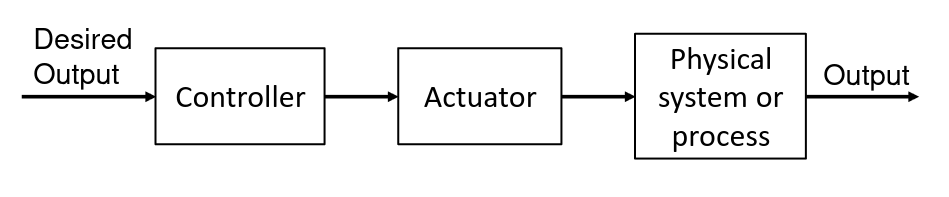
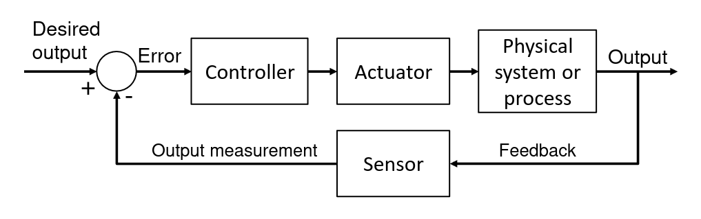

# Control Systems

## Introduction

A control system is part of a CPS which is configured to provide a desired system response.

There are 2 main types of control systems:

Open-loop which uses a controller and an actuator to provide the desired response:
- Actuator - Acts over the real system
- Controller - Causes the Actuator to Act

Closed-loop which uses feedback from the actuator as input for the controller, this is done by measuring the desired output with the real output response.
Requires the usage of a sensor to measure the output.

The process of desining a control system is multi-phased
- Establish control goals
- Identify variables to be controled
- Write Specifications
- Establish system configuration
- Obtain models of the process
- Describe controller and select parameters
- Optimize parameters

## Modelling Physical Systems

To accuratly obtain "models of the process" as indicated above we need to define mathematical and physical models with describe our physical system. These models usauly are mathematical models.

There are 2 main types of models
- Continuos - Provide continuos evolution of the model
- Discrete - Provide evolution of the system at discrete intervals

## Continuos Models

Since most models represent dynamic relations in nature, we usually use diferencial equations as means to describe our systems

This beacuse most physical relationshisp are modelled on the basis of diferencial equations.

Newton's Law - The sum of all forces in a system equals to zero

Depending on the model we are trying to model different rules/equations will need to be applied.

Some properties of continous systems
- Causality
  1. Causal system - Output depends only on current and past inputs, and not in future inputs
  2. Strictly causal - Ouput depends only on past inputs, and not in current or future inputs
- Memoryless
  1. System with memory - Output depends on current, past and future inputs (if not causal)
  2. System without memory - Output at time t depends of inputs at time t
- Linearity - System is linear if it satisfies
  1. Superposition - Given $y_1(t)=f(x_1(t))$ and $y_2(t)=f(x_2(t))$ then $y_1(t) + y_2(t) = f(x_1(t) + x_2(t))$
  2. Homogeneity - Given $y(t)=f(x(t))$ then $B(y(t))=B(f(x(t)))$
- Time-Invariance - A system is invariant of time if gives out output which doesnt depend on time
- Stability - This is true if for all bounded input signals the system gives bounded output signals 