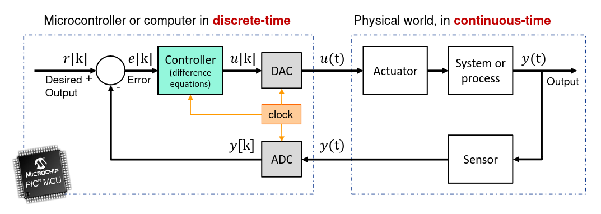
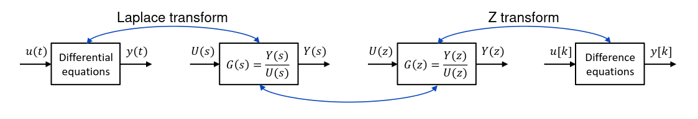

# Discrete Models

The usage of discrete data comes very naturlly to computers given this is the type of data they usually manage

To convert continous data into discrete data we have multiple types of ways:
- Analog signal
- Quantized signal
- Sample data signal
- Digital signal

The conversion between types of sinals between the real environment and the computer is usually done using specific hardware:
- Analog to Digital Converter (ADC)
- Digital to Analog Converter (DAC)

In a closed loop system this type of hardware couldbe placed as such:

Their purpose will be to convert real data into something compreensible by the computer (ADC) and to convert computer commands into something understandable by the sensors (DAC).

## Digital controller Implementation

This type of controller usually works based on difference equations, a type of equation that based on an error value give accurate acessement of a new action.
They are the discrete time equivalent to differential equations.

$$u[k+1]=f(e[0],...,e[k],e[k+1]; u[0],...,u[k])$$

They take as parameters the accumulated error over time until the current time, and the values os the controller output until time-1.

Just like we use laplace transform in differential equations to convert them to transfer function, Z transform is usd in difference equations to convert them into transfer functions.

Considering we can easily do the inverse property of both the laplace transform and the Z transform this means we can convert the Discrete systems to Continuos and the other way around.

In a nutshell we can model continuos systems as discrete, using this method.
Taking into account it will only be an aproximation of the real system, and that we are sampling values to make the transition.

