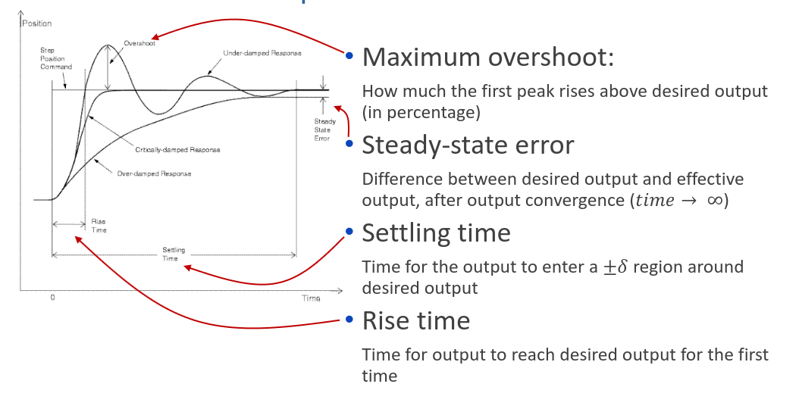

# PID controller

In the previous note we discussed how to implement controllers based on discrete and continuous time.

Now we will see one of the most used controller types.

PID stands for
- Proportional
- Integral
- Derivative

These will be the 3 terms of the PID controller.

Which are joined in the equation used by the controller to give values to the actuator

$$u(t)=K_pe(t)+K_i\int_0^te(\pi)d\pi+K_d\frac{de(t)}{dt}$$

in which we have the 

Proportional term, the present
$$K_pe(t)$$

Integral term, the past
$$K_i\int_0^te(\pi)d\pi$$

Derivative term, the future
$$K_d\frac{de(t)}{dt}$$

All while the specific values are defined at runtime, 3 values are defined by the programmer which are : $K_p,K_i,K_d$

Each value has a meaning and effect:
- High P - More overshoot, faster response and steady-state different from 0
- High I - Less overshoot, slower response and steady-state equal to 0
- High D - Less overshoot, faster response and steady-state different from 0

Depending on these values the PID controller will behave in different ways.

Some important characteristics

As we can see above the method indicated is a differential equation and as such can be easily converted using Laplace transform and Z transform into a difference equations.

Therefore we can conclude that PID can be used for both discrete and continuos systems.

To determine $K_p,K_i,K_d$, there is a simple method
- Set all values to 0
- Increase $K_p$ until the output oscillates steadily
- Take note of this value of $K_p$ called $K_c$
- Use this value as base and change the others

The purpose of each of the terms is the following
- Proportional - Immediate correction (the farther off u are the bigger correction)
- Integral - Over time correction (if not making process add more correction)
- Derivative - Take it easy correction (going to fast add correction)