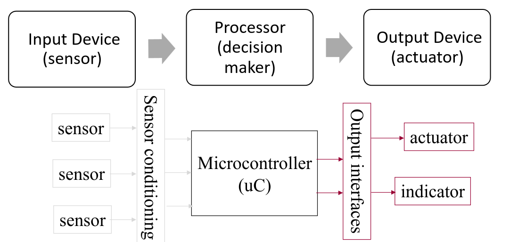

# Control Technologies

We have discussed how the communication is made between the computer and the system, we have discussed how the signals are transferred between these 2 differnt components.

But the fact is that usually we need to keep the computer in the system permenantly, which is bad if we want to sell a device beacuse it would mean selling complex computers with every device we want to sell.

To this effect, we usually ship the devices with smaller computers also called microcontrollers.

A microcontroller is a programmable device, which serves the same purpose of a computer, but has limited resources and computing power.

It is usually ideal for this type of situation given it is less costly and the resource limitations dont affect us depending on the problem.

This type of machine like a normal computer has a CPU, which is in this cased called a microprocessor, which is smaller and less powerfull but still has the necessary features.

## MicroProcessor (MCU)

There are some crucial metrics when selecting a MCU:
- Power consumption
- Clock Frequency
- IO pins
- Memory
- Internal Functions
- Others

From all of these there are some which have some caveats:

I/O pins can be made in 2 ways
- Port I/O - Devices registers are mapped to ports, which are mapped to a separate address space and require alternative functions to interact with
- Memory Mapped I/O - Device registers are mapped to regular address space in the processor memory, which means they can be interacted with using normal memory writing operations

Both these approaches have their ups and downsides:

Port I/O
- Instructions are architecture dependant
- Need special hardware in the processor to make work

Memory mapped I/O
- Can use all memory reference instructions from I/O
- Memory protection is more flexible
- Can reuse memory management

## MMO

Similar to RAM but in microprocessors

Has one major difference than RAM, sometimes this type of system is made in a way that it responds whenever memory is written or read.

To this effect reads and writes in MMO need to be considered carefully beacuse they can lead to unexpected reads or writes.

## Code

Take into account take in order for the microprocessor to work it will require code, this code is usually passed to the microprocessor using a USB cable from a normal computer.

After the code is passed it will be able to be run independantly from the computer, with the caveat that considering the USB cable served as a power source it will require a new power source after the computer is disconnected.