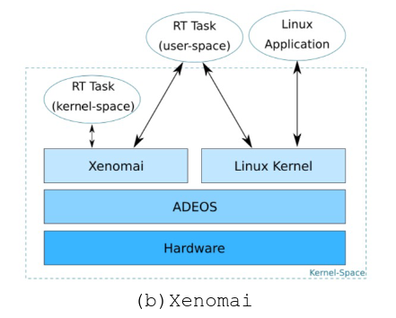

# Real time OS

Just like we wouldn't use normal computers for our CPS, or use normal operating systems for our CPS

There are problems in using normal OS's for our CPS, to this effect we use Real Time OS's.

The main differences are:
- Real Time OS under worst case behavior:
  1. Always predictable
  2. Timing guarantees
- General Purpose OS under normal case behavior:
  1. Most of the time good behavior
  2. High throughput

The main architectural difference between normal and real-time OS is the kernel

The kernel, while not necessary for some problems, is a big help with assuring the application can meet their processing deadlines given the computational power allows for faster computation times.

Some of the advantages of the RT kernel are:
- Abstracting away time information
- Team development
- Modularity
- Idle time utilization
- Flexible interrupt calling

Normal OS's like linux do not have such features which brings some problems, in linux case the major ones are:
- Applications run in user space
- Hardware interaction is in kernel
- Kernel not preempted by user threads
- Classic time sharing schedule

To this effect an alternative OS was made Real-Time Co-Kernel Linux

The main differences for this OS are:
- Usage of RT scheduler for RT tasks, and NT scheduler for NT tasks
- RT coexists with normal linux but in higher priority
- Interception of events going to linux by RT, to maintain higher priority by RT

To this effect multiple implementation exist with this concept in mind
  

We will focus more in Xinomai

One of the most relevant features is ADEOS or Adaptive Domain Environment for Operating Systems

This service adds a layer of virtualization on top of the hardware. This layer manages the flow of events through domains (OS's running on the hardware).

The flow is made from highest to lowest priority, and each domain can stall events.
