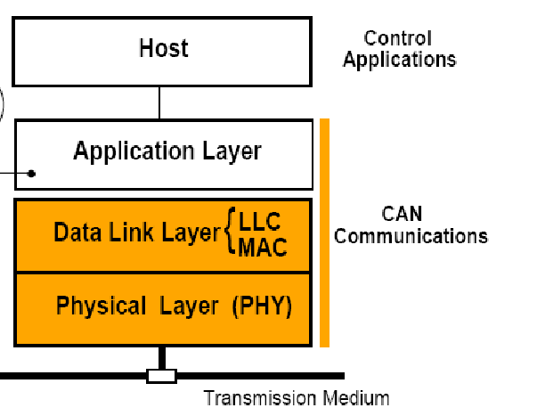
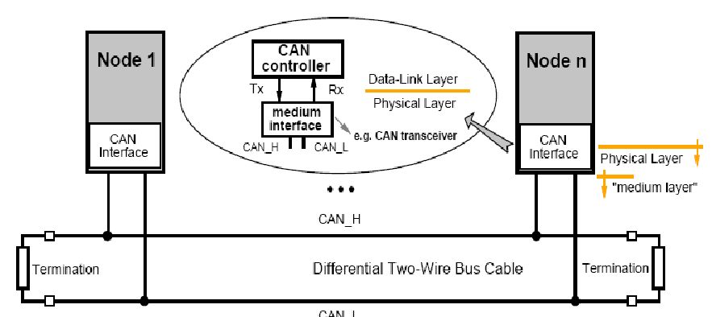
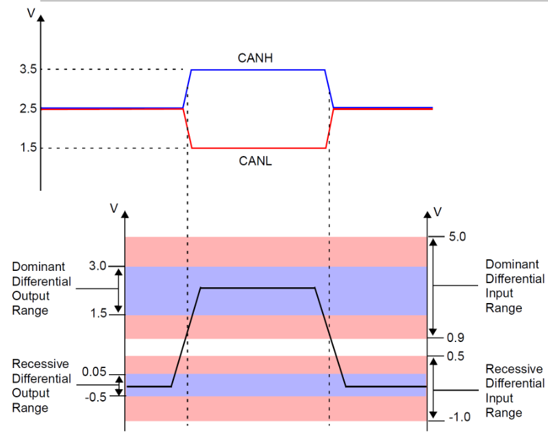
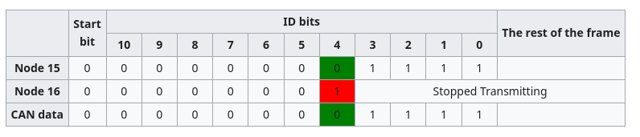
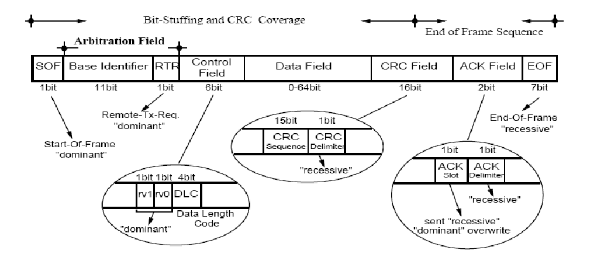
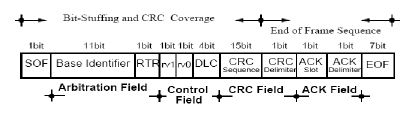

# CAN

CAN or control area network is a type of sensor network normally used in cars.

It is composed of 3 layers

It allows for bit transfer between different nodes in the network it includes bit-timing, synchronization and encoding.

Nodes are connected to the transmission medium like:

## Differential BUS

Unlike other communication methods which resort to a common bus

In CAN we have a differential BUS this means that instead of using the bus to put direct binary values we use 2 different signal strengths to achieve a different result.

In this bus we use 2 signals CANH (CAN high) and CANL (CAN low), in this situation the 2 signals can be used to represent:
- A dominant signal - CANH > CANL
- A recessive signal - CANL > CANH

This 2 signals are then mapped to either a 0 for dominant or a 1 for recessive.

The main upside of this approach is the fact that any noise will influence both signals similarly, which allows for the network to take this noise into consideration when receiving the signal.

This permits better noise cancellation by the system

In the Bus a single bit can be transferred a the time.

## Fault tolerance

The system has built in fault tolerance given the bus is composed from 2 wire. Allowing for one wire to break and system maintain operational.

## Communication Paradigm

Each packet is labelled with an unique identifier, which allows for better encapsulation of the network.

Allowing for disambiguation of object meaning and removing the need for source/destination

## Network level Information Packets

2 types of frames
- Data Frame - dissemination of communication objects
- Remote Frame - request for communication objects

## Medium Access Control

Nodes will delay their trasnmition until the BUS is idle, this is detected using the value in the BUS.

Any communication conflits are solved with bit-wise comparison.

Given each object will have a unique identifier, each node start the communication attempt by transmiting the identifier of the object it is going to transmit.

The node will at the same time, read from the bus the value presented in the bus, if this value is different from the one it transmited it will detect a conflict and go to observation mode.

Considering 0 are dominant and 1 are recessive, we can see that lower ID values will have higher priority given they start with more 0's.

If 2 ids are the same priority is given to DataFrames

## DataFrame/RemoteFrame Format

| Field name                               | Length (bits)    | Purpose                                                                                                                                                          |
| ---------------------------------------- | ---------------- | ---------------------------------------------------------------------------------------------------------------------------------------------------------------- |
| Start-of-frame                           | 1                | Denotes the start of frame transmission                                                                                                                          |
| Identifier (green)                       | 11               | A (unique) identifier which also represents the message priority                                                                                                 |
| Stuff bit                                | 1                | A bit of the opposite polarity to maintain synchronisation; see [Bit stuffing](https://en.wikipedia.org/wiki/Bit_stuffing "Bit stuffing"), below                 |
| Remote transmission request (RTR) (blue) | 1                | Must be dominant (0) for data frames and recessive (1) for remote request frames (see [Remote Frame](https://en.wikipedia.org/wiki/CAN_bus#Remote_frame), below) |
| Identifier extension bit (IDE)           | 1                | Must be dominant (0) for base frame format with 11-bit identifiers                                                                                               |
| Reserved bit (r0)                        | 1                | Reserved bit. Must be dominant (0), but accepted as either dominant or recessive.                                                                                |
| Data length code (DLC) (yellow)          | 4                | Number of bytes of data (0–8 bytes)[[a]](https://en.wikipedia.org/wiki/CAN_bus#cite_note-16)                                                                     |
| Data field (red)                         | 0–64 (0-8 bytes) | Data to be transmitted (length in bytes dictated by DLC field)                                                                                                   |
| CRC                                      | 15               | [Cyclic redundancy check](https://en.wikipedia.org/wiki/Cyclic_redundancy_check#CRC-15-CAN "Cyclic redundancy check")                                            |
| CRC delimiter                            | 1                | Must be recessive (1)                                                                                                                                            |
| ACK slot                                 | 1                | Transmitter sends recessive (1) and any receiver can assert a dominant (0)                                                                                       |
| ACK delimiter                            | 1                | Must be recessive (1)                                                                                                                                            |
| End-of-frame (EOF)                       | 7                | Must be recessive (1)                                                                                                                                            |
### DataFrame Struct

### RemoteFrame Struct

## Bit Stuffing

In order to ensure transitions maintain synchrony, every 5 consecutive bits a bit of oposite polarity is inserted.

This bit won't be considered by the receiver and it will be de-stuffed.

It also allows for better understanding by receivers of the location of the end of the frame.
Given this they are usually used along the entire frame from the SOF to the CRC sequence.

This mechanism has one downside, it affects DataFrame size and can lead to significantly bigger DataFrames. In worst case it can make then $n + 1/5*n$

## Error handling

There are 5 types of error CAN detect for
- Bit error - mismatch between received and transited
- Bit-stuffing error - more than 5 consecutive bits
- CRC error - mismatch between received and computed
- ACK error - lack of acknolagment at the ACK slot
- form error - violation of frames fixed sequence

Usually to raise an error, a certain part of the message is left recessive on purpose by the sender, if any receivers notice an error they can put said part of the message to dominant to indicate to the sender they detected an error.

If an error is detected all nodes forget the last transmission and the sender has to retransmit the data.

# ProfiBUS

ProfiBUS or process field bus is a digital network that allows communication between sensors.

In this network there are 2 types of stations
- Slaves
- Masters

Allows for multiple masters, which pass a token around which gives them access to the slaves.
The token permits a master get information about the slaves

The time each master has the token is predetermined
- TTRT : Target Token Rotation Time
- THT : Target Holding Time
- THT = TTRT - LastRotation

# TTP

Time triggered protocol is the base protocol used by profibus.

TTP Cycles - A mode where nodes take turns broadcasting predetermined messages

TTP has 2 types of frames
- I-Frames - Used for initialization (can also be used to resync nodes to a cluster)
- N-Frames - Used for normal messages
- 

## System overview

Space Redundancy - Comes from the fact the BUS is replicated

Time Redundancy - Broadcasts are duplicated

### FTU

Fault Tolerant Unit or FTU is a part of the profibus network, it is connected to multiple nodes and its job is to do fault tolerance over said nodes

There are 4 different levels of FTU
- Class 1 - One node per FTU with 2 frames per FTU (used when cable failures are prevalent)
- Class 2 - Two nodes per FTU with 2 frames per FTU (each node will send one frame in of the buses)
- Class 3 - Two nodes per FTU with 4 frames per FTU (each node will send two frame in each of the buses)
- Class 4 - Two nodes and a shadow node per FTU, shadow nodes transmit the same state has active nodes, but do not transmit messages with 4 frames per FTU 