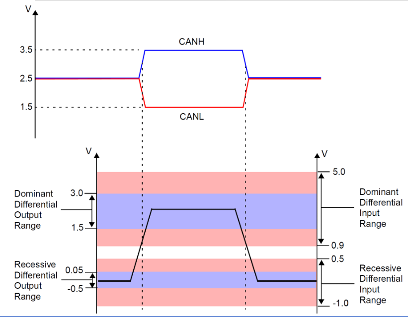
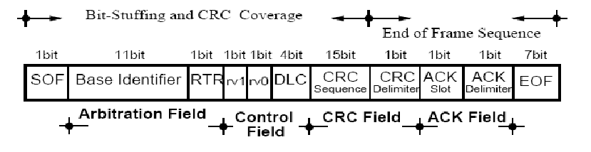

# CAN Field-bus

CAN(Controller Area Network)
This type of networks removes some of the normal layers of the normal 5 layers of the internet networks
In this type of network we have 3 layers
- Application Layer
- Data Link Layer
- Physical Layer
The lack of need of the other layers come from the fact there is no need for addressing in this type of networks

## Physical Layer
This type of network was create by Bosch
The communication in this type of network makes usage of BUS's, and each node is connected to the BUS
The nodes can write and read from the BUS to obtain the data from the the other node

## Differential Bus
In order to defend this bus from possible noises coming from the environment
In order to do this the cables send 2 signals, each one on a different tension
In order to obtain the real signal from these 2 signals, we find the difference between their tensions and this will be the value, any noise will affect both signals in the same way, which will lead to and undisturbed signal from alterations resultant on noise

## Controller Area Network

### Carrier Sense Multi-Access With Deterministic Collision Resolution
While in the internet we have ways to deal with the situation where 2 nodes are trying to communicate at the same time
In CAN we have this
It requires that objects in the network have different IDS, take into account this ID is dependant on the node transmuting.
So Node 1 and Node 2 can have different IDS of object A

This goes as follows
- 2 nodes try to write to the bus
- They start by writing the RTR intensifier
- after this each node compares the transmited bit with the one read from the bus
- If they are diferent the ndoe which sent the  recessive bit stops transmiting
- when a node stops trasmiting, it becomes a receviver

This leads to identifiers, with lower values having higher priority than ones with higher values.

### Remote Frame Standard Format
When sending messages thorugh can we follow the following format for connections

This transaltes to:
- We send the identifier, and the value we are trying to send
- The RTR and some versions
- We then send the CRC (Cycle Recovery Control?), which will be delimited by the CRC delimiter
- We then expect to receive and ACK, and its delimiter

The identifier sent will be the object identifier we are trying to send
The RTR is the ?
The CRC as some pupose
The ACK will be a bit which the sender will send as recessive, and which the receivers should send as dominant if they received the value correctly
The ACK delimiter will be used by the values which recievde incorrectly to indicate that they received incorrectly, and that this means that no one should save the last message sent.
The sender will recieve this message, and hopefully resend the message.

# Profibus

Process Field Bus
